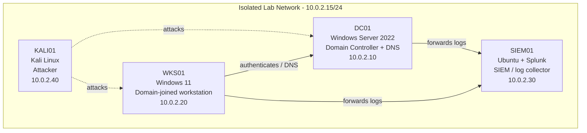

# SOC Home Lab — Session: Ubuntu Test 2

> Built and documented in an isolated home lab environment that I own.
> Documentation generated with LabScribe and reviewed by hand.

## 1. Overview

This session ("Ubuntu Test 2", 2026-08-02 05:40:57 → 06:01:53) was a short capture-verification run on the Ubuntu host `soc-lab-ubuntu`, logged in as the `socadmin` user. No lab services were installed, configured, or changed. The transcript consists of confirming that the LabScribe capture environment variable was set (`LABSCRIBE_ACTIVE=1`), checking the working directory, listing an empty home directory, and exercising the shell — including two mistyped/foreign commands that produced "command not found" errors. A second transcript file (`test.txt`) was captured but is empty. Treat this session as tooling validation rather than lab build work; the host inventory and network topology below are carried forward from prior lab configuration, not re-verified here.

| Host | OS | Role | IP |
|---|---|---|---|
| DC01 | Windows Server 2022 | Domain Controller + DNS | 10.0.2.10 |
| WKS01 | Windows 11 | Domain-joined workstation | 10.0.2.20 |
| SIEM01 (`soc-lab-ubuntu`) | Ubuntu + Splunk | SIEM / log collector | 10.0.2.30 |
| KALI01 | Kali Linux | Attacker box | 10.0.2.40 |

> Only `soc-lab-ubuntu` (SIEM01) appears in this session's transcripts. Its IP address was not confirmed during this session; the value shown is carried over from the recorded lab topology. Lab subnet recorded for the session: `10.0.2.15/24`.

## 2. Network Diagram

## 3. Build Steps

### SIEM01 — `soc-lab-ubuntu`

No configuration changes were made to this host during the session. The commands run were read-only checks:

1. **Verified the capture harness was active** — `echo $LABSCRIBE_ACTIVE` returned `1`, confirming the shell session was being recorded by LabScribe. Worth doing first in every session: if this variable is unset, the transcript is not being collected and the work is undocumented.
2. **Confirmed shell context** — `pwd` returned `/home/socadmin`, and `ls` returned no output, indicating the `socadmin` home directory is empty (no visible files yet). This establishes that no lab artifacts, scripts, or Splunk installers have been staged on this host so far.
3. **Confirmed the shell and its builtins** — `help` reported **GNU bash, version 5.3.9(1)-release (x86_64-pc-linux-gnu)** and listed the builtin command set. This pins down the shell version for any later scripting or forwarder-install steps.

No Splunk installation, no log-forwarding configuration, no network configuration, and no service checks were captured for this host.

### DC01, WKS01, KALI01

*No activity captured for this section yet.*

Screenshots: *none captured this session.*

## 4. Troubleshooting Log

| Issue | Cause | Fix |
|---|---|---|
| `LS: command not found` | Linux commands are case-sensitive; `LS` (uppercase) is not a valid binary — the correct command is `ls`. Likely muscle memory from a case-insensitive shell. | Re-ran the command as lowercase `ls`, which succeeded (no output, directory empty). |
| `Command 'cmd' not found, but there are 22 similar ones.` | `cmd` is the Windows command interpreter and does not exist on Ubuntu. Appears to be a habit carried over from the Windows lab hosts (DC01/WKS01). | The user moved on to `help`, using the native bash builtin listing instead. On Ubuntu the equivalents are `bash`, `sh`, or simply the current shell. |
| Second transcript `test.txt` was captured but is completely empty | Appears to be a stray/placeholder capture file — a `script` session that recorded nothing, or a test artifact created while validating the capture pipeline. | No fix applied in-session. Recommend deleting empty capture files before synthesis so they don't dilute the session record. |

## 5. Attack & Detection Scenarios

*No activity captured for this section yet. No attacker (KALI01) commands and no SIEM01 searches or detections were recorded during this session.*

| Scenario | Attack (KALI01) | Detection (SIEM01) | Status |
|---|---|---|---|
| *(none this session)* | — | — | — |

## 6. Lessons Learned

- Checking `$LABSCRIBE_ACTIVE` at the start of a session is a cheap sanity check — it confirms the transcript is actually being captured before any real work begins.
- Switching between the Windows hosts and the Ubuntu host in the same lab invites cross-platform typos (`LS`, `cmd`). Both errors here were harmless, but the same reflex on a privileged command could be less benign.
- Empty capture files (`test.txt`) add noise to the session record; prune them before generating documentation.
- SIEM01's `socadmin` home directory is still empty, so Splunk deployment and log-forwarding setup remain open work items.

## 7. Changelog

- **2026-08-02 — Session: Ubuntu Test 2 (05:40:57 → 06:01:53).** Capture-tooling validation on `soc-lab-ubuntu` (SIEM01). Confirmed `LABSCRIBE_ACTIVE=1`, working directory `/home/socadmin` (empty), and bash 5.3.9(1)-release. No configuration changes. Logged three issues: `LS` case-sensitivity error, `cmd` not present on Linux, and an empty `test.txt` transcript. No screenshots, no quick notes, no attack/detection activity.