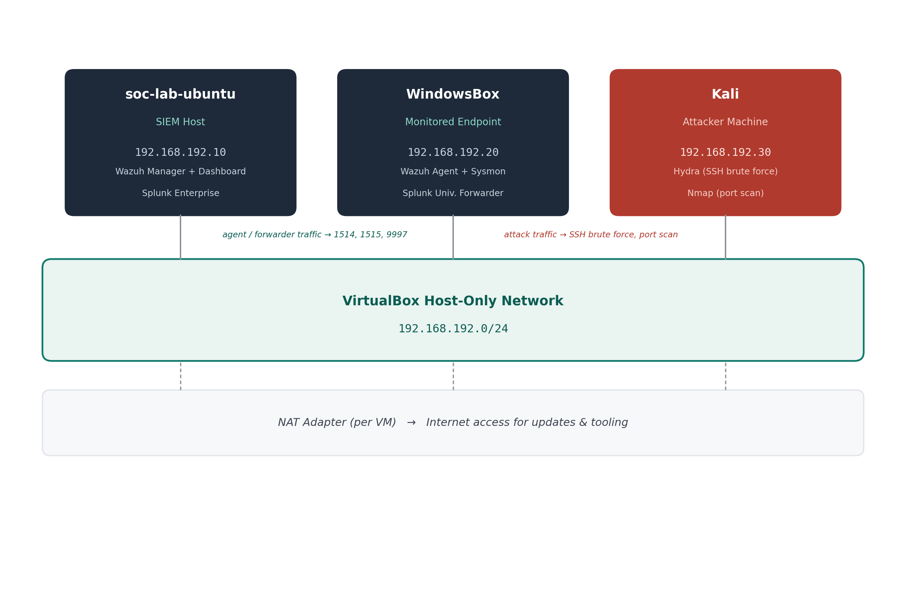

# Home SOC Lite Lab

A home-built Security Operations Center lab covering log pipeline architecture, custom detection engineering, and end-to-end incident investigation — built and documented from the ground up on Wazuh and Splunk.

**[📄 Full Report (Word)](./SOC_Lite_Lab_Report.docx)**

---

## Overview

Three VMs, two SIEM platforms, one attacker box. The lab simulates a minimal real-world SOC: a central log aggregation/analysis host, a monitored Windows endpoint, and a separate adversarial machine used to generate genuine attack traffic — not synthetic test data.

| | |
|---|---|
| **Detections built** | 3 custom Wazuh rules, tested against live attack traffic |
| **Attack sources** | SSH brute force (Hydra), full-port SYN scan (Nmap) |
| **SIEM platforms** | Wazuh (Manager + Dashboard) and Splunk Enterprise, run in parallel for cross-validation |
| **MITRE ATT&CK coverage** | T1110.001 (Password Guessing), T1046 (Network Service Discovery) |

## Architecture



| Component | Details |
|---|---|
| **SIEM Host** (`soc-lab-ubuntu`) | Ubuntu Server · `192.168.192.10` — Wazuh Manager + Dashboard, Splunk Enterprise |
| **Monitored Endpoint** (`WindowsBox`) | Windows 11 · `192.168.192.20` — Wazuh Agent, Sysmon (SwiftOnSecurity config), Splunk Universal Forwarder |
| **Attacker Machine** (`Kali`) | Kali Linux · `192.168.192.30` — Hydra, Nmap |
| **Network** | VirtualBox host-only adapter (`192.168.192.0/24`) for lab traffic; independent NAT adapter per VM for internet access |

## Detections

| Rule ID(s) | Detection | MITRE ATT&CK | Logic |
|---|---|---|---|
| `100010` | SSH brute force | T1110.001 | 4+ failed SSH logins from the same source IP within 60 seconds |
| `100011` | Successful login following brute force (possible compromise) | T1110.001 | Successful SSH login from a source IP that just triggered `100010` |
| `100012` / `100013` | Port scan (firewall block correlation) | T1046 | `100013` escalates when 10+ UFW-blocked connection attempts occur from the same source within 30 seconds |

Full rule XML, decoder logic, and the reasoning behind each threshold are in the [report](./SOC_Lite_Lab_Report.docx) and in [`local_rules.xml`](./local_rules.xml) / [`local_decoder.xml`](./local_decoder.xml).

## What's in this repo

```
├── SOC_Lite_Lab_Report.docx   # Full write-up: architecture, detections, investigations, lessons learned
├── local_rules.xml            # Custom Wazuh detection rules (100010–100013)
├── local_decoder.xml          # Custom Wazuh decoder for parsing UFW firewall logs
├── architecture.png           # Network topology diagram
└── README.md
```

## Highlights from the build

- Designed and tuned two multi-stage correlation rules from scratch, including an escalation rule that only fires when a brute-force pattern is immediately followed by a successful login — a stronger, lower-noise signal than either condition alone.
- Diagnosed and fixed a Windows Event Log permissions issue (Sysmon's "Operational" channel enforces a stricter ACL than legacy Security/System channels) — and confirmed the same root cause independently on both Wazuh and Splunk.
- Built a custom Wazuh decoder to parse UFW firewall logs, which aren't understood by Wazuh's ruleset out of the box, to enable port-scan detection.
- Debugged real Wazuh rule-frequency semantics (`frequency="N"` means N matches *beyond* the first, not N total) and event-ordering dependencies in correlation rules.

Full narrative, screenshots, and terminal evidence for all of the above are in the report.

## Limitations & Next Steps

This is a lab-scale environment, not a hardened production deployment — detection thresholds were tuned against a single attacker on an isolated /24, all three detections are alert-only (no automated response), and coverage is currently limited to authentication abuse and network reconnaissance. Planned next steps include DNS-based threat detection, active-response auto-blocking, and expanding the attack chain with tools like Metasploit. See the report's *Limitations & Future Work* section for the full list.

## Tools

Oracle VirtualBox · Wazuh · Splunk Enterprise + Universal Forwarder · Sysmon (SwiftOnSecurity config) · Hydra · Nmap · UFW

## Troubleshooting Log

A sample of the real configuration errors hit and resolved while building the detections — kept here because the fixes are non-obvious and worth documenting for anyone hitting the same issues.

| Issue | Cause | Fix |
|---|---|---|
| `wazuh-manager.service` failed to start; `wazuh-analysisd: CRITICAL: Error loading the rules` | Custom rule `100010` in `local_rules.xml` was missing a closing `>` on the opening `<rule ...>` tag, breaking the XML | Corrected the malformed `<rule>` tag and restarted `wazuh-manager` |
| `wazuh-logtest` matched raw SSH failure log lines only to the generic rule 1002 ("Unknown problem") | The custom brute-force rule referenced a base SID that wasn't yet correctly wired to the decoded event | Resolved once the correlation rule was pointed at the correct base rule (5760) and validated via `wazuh-logtest` |
| `tail: cannot open '/var/log/ufw.log'` (repeated) | UFW logging was enabled but no traffic had yet been blocked, and/or rsyslog wasn't routing kernel UFW messages to that file yet | Restarted the `rsyslog` service and generated blocked traffic from Kali (Nmap/Hydra), after which `/var/log/ufw.log` was created and populated |
| `wazuh-logcollector: ERROR: Could not open file '/var/log/ufw.log'` | Wazuh's `ossec.conf` `<localfile>` block pointed at `/var/log/ufw.log` before the file existed | Resolved once UFW actually began logging block events to that path |
| `wazuh-analysisd: ERROR: Syntax error on regex: '\[UFW BLOCK\]'` | The `prematch` regex used escaped brackets, which Wazuh's regex engine rejected | Simplified `prematch` to the plain string `UFW BLOCK` with no escaped brackets |
| `wazuh-analysisd: ERROR: Parent decoder name invalid: 'ufw-block'` | The `ufw-block` decoder was defined with `<program_name>kernel</program_name>` instead of `<parent>kernel</parent>`, so it wasn't recognized as a valid parent for child decoders | Changed the decoder to use `<parent>kernel</parent>` and added `<use_own_name>yes</use_own_name>` |
| Legitimate lab traffic (agent/manager comms) dropped after tightening UFW | Narrowing the broad "allow from subnet" rule to `allow ... to any port 22` also blocked port 443 traffic the Wazuh dashboard needed | Added an explicit `ufw allow from 192.168.192.0/24 to any port 443` rule after observing the blocked traffic in `ufw.log` |

## Lessons Learned

- Malformed custom Wazuh XML (rules or decoders) causes `wazuh-manager` to fail to start entirely — check `ossec.log` / `journalctl -xeu wazuh-manager` immediately after any edit, not just systemd's generic failure message.
- Decoder `<parent>` chains in Wazuh must reference a decoder that itself declares `<parent>` correctly, plus `<use_own_name>yes</use_own_name>` if child decoders need to attach to it — using `<program_name>` instead of `<parent>` on the base decoder silently breaks child-decoder inheritance.
- UFW log entries don't appear in `/var/log/ufw.log` until rsyslog is actively routing kernel `[UFW BLOCK]` messages *and* at least one packet has actually been blocked — an empty/missing log file is expected before both conditions are met.
- Broadening a firewall allow-rule to fix one problem can be too permissive from a security-monitoring standpoint; narrowing rules to specific ports is safer but requires verifying every legitimate traffic path first.
- Iterative validation with `wazuh-logtest` against real captured log lines was essential for confirming decoder/rule fixes without needing to regenerate attack traffic every time.

## Documentation Note

Terminal sessions across all three VMs were captured with LabScribe throughout the build. This README and the full report were written from those transcripts plus direct review of the Wazuh/Splunk dashboards, then checked by hand against the actual configuration files for accuracy.

## Contact

**Devin**
[LinkedIn](https://www.linkedin.com/in/devin-phillips-b35700269/) · [GitHub](https://github.com/DevinCodes13) · 144kfilms@gmail.com
