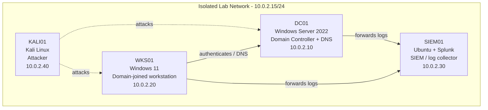

# SOC Home Lab — SIEM01 Splunk Enterprise Install

> Built and documented in an isolated home lab environment that I own.
> Documentation generated with LabScribe and reviewed by hand.

## 1. Overview

This session covered the installation and first successful start of Splunk Enterprise 10.4.2 on the lab's SIEM host (`soc-lab-ubuntu`). The `.deb` package was pulled directly from Splunk's download site, installed with `dpkg`, configured to start at boot, and given an administrator account during first run. Splunk Web was switched to HTTPS via a new `web.conf`, after which the service failed to come up on a plain `splunk restart` (Splunk refused to run as root without an explicit flag) and had to be started with `--run-as-root`. Session notes indicate both Splunk and Wazuh ended the session reachable from the VM and from the host machine's browser. One open item remains: permission denied when attempting to read logs from the Ubuntu terminal. No attack or detection work was performed in this session.

| Host | OS | Role | IP |
|---|---|---|---|
| DC01 | Windows Server 2022 | Domain Controller + DNS | 10.0.2.10 |
| WKS01 | Windows 11 | Domain-joined workstation | 10.0.2.20 |
| SIEM01 (`soc-lab-ubuntu`) | Ubuntu + Splunk 10.4.2 (+ Wazuh) | SIEM / log collector | 10.0.2.30 |
| KALI01 | Kali Linux | Attacker box | 10.0.2.40 |

*Only SIEM01 was worked on in this session; the other host details are carried over from the lab network configuration reflected in the diagram below and were not re-verified here.*

## 2. Network Diagram



## 3. Build Steps

### SIEM01 — `soc-lab-ubuntu` (Ubuntu, user `socadmin`)

1. **Downloaded the Splunk Enterprise package.**
   ```bash
   wget -O splunk-10.4.2-33c3bf42cd73-linux-amd64.deb \
     "https://download.splunk.com/products/splunk/releases/10.4.2/linux/splunk-10.4.2-33c3bf42cd73-linux-amd64.deb"
   ```
   1,333,481,984 bytes (1.2 G) downloaded in ~45 s, averaging 28.4 MB/s, saved into the `socadmin` home directory. Pulling the vendor package directly (rather than a repo mirror) pins the exact build ID, which matters later — the install verifies files against `/opt/splunk/splunk-10.4.2-33c3bf42cd73-linux-amd64-manifest`.

2. **Installed the package.**
   ```bash
   sudo dpkg -i splunk-10.4.2-33c3bf42cd73-linux-amd64.deb
   ```
   Two earlier attempts failed on wrong paths/filenames (see Troubleshooting Log). The successful run unpacked and set up `splunk (10.4.2)` into `/opt/splunk`, emitting one benign `find:` warning about a missing `python3.7/site-packages` path before printing `complete`.

3. **Enabled boot-start and completed first-run setup.**
   ```bash
   sudo /opt/splunk/bin/splunk enable boot-start
   ```
   This paged the Splunk General Terms (accepted with `y`) and then triggered first-run administrator account creation: username `admin`, password `[REDACTED]`. The command finished by writing an init script at `/etc/init.d/splunk` and configuring it to run at boot — important for a lab SIEM, since the collector needs to be up whenever the VM is, not only when someone logs in.

4. **Enabled HTTPS on Splunk Web.**
   ```bash
   sudo cat /opt/splunk/etc/system/local/web.conf   # empty — file did not exist yet
   sudo nano /opt/splunk/etc/system/local/web.conf
   ```
   The resulting file was confirmed in the next transcript as:
   ```ini
   [settings]
   enableSplunkWebSSL = true
   ```
   Forcing TLS on port 8000 means the admin credentials created in step 3 are not sent in the clear across the lab segment — worth doing even in an isolated lab so the habit carries over.

5. **Started splunkd.** A plain `splunk restart` did not bring the daemon up (see Troubleshooting Log). The working invocation was:
   ```bash
   sudo /opt/splunk/bin/splunk start --accept-license --run-as-root
   ```
   Preflight passed: http port 8000, mgmt port 8089, appserver 127.0.0.1:8065, and kvstore 8191 all open; runtime directories under `/opt/splunk/var` created; new certs generated in `/opt/splunk/etc/auth`; default indexes validated (`_audit`, `_internal`, `_introspection`, `main`, `summary`, etc.); and all installed files verified intact against the release manifest. `Starting splunk server daemon (splunkd)...` followed.

6. **Verified web access.** Per session notes, Splunk and Wazuh were both confirmed accessible from the VM and from the host machine's browser (the two `chrome_*.png` captures appear to be those browser sessions — see `chrome_RPsy7tVg48.png` and `chrome_S8Xxs3lh73.png`; `VirtualBoxVM_YEVumwIsUS.png` appears to be the VM console view).

### DC01 / WKS01 / KALI01

*No activity captured for this section yet.*

## 4. Troubleshooting Log

| Issue | Cause | Fix |
|---|---|---|
| `dpkg: error: cannot access archive '/media/sf_LabCapture/splunk-*.deb': No such file or directory` | Install was attempted from the VirtualBox shared-folder path, but `wget` had saved the package into the `socadmin` home directory, not the shared folder. | Ran `dpkg -i` against the file in the home directory instead of `/media/sf_LabCapture/`. |
| `dpkg: error: cannot access archive 'splunk.deb': No such file or directory` | The `wget -O splunk.deb` output name was edited mid-command line to the full upstream filename, so `splunk.deb` never existed on disk. | Used the actual saved filename: `sudo dpkg -i splunk-10.4.2-33c3bf42cd73-linux-amd64.deb`. |
| `find: '/opt/splunk/lib/python3.7/site-packages': No such file or directory` during `Setting up splunk (10.4.2)` | Cosmetic — a post-install script referencing a legacy Python path that this build no longer ships. Install still reported `complete`. | No action required; install proceeded and later file-integrity validation reported "All installed files intact." |
| `sudo /opt/splunk/bin/splunk restart` printed only *"Running Splunk Enterprise as root is deprecated… To run as root, use the --run-as-root option"* and returned to the prompt | Splunk refused to start under root without the explicit opt-in flag, so `restart` was effectively a no-op — nothing was ever brought up. | Re-ran as `sudo /opt/splunk/bin/splunk start --accept-license --run-as-root`. Longer-term fix is to run splunkd as a dedicated non-root `splunk` user rather than keep passing this flag. |
| `curl -vk https://localhost:8000` → `connect to ::1 port 8000 ... Connection refused` / `connect to 127.0.0.1 port 8000 ... Connection refused` / `curl: (7) Failed to connect` | Downstream symptom of the above — splunkd was not running, so nothing was listening on 8000. Not a TLS or `web.conf` problem. | Confirmed with `sudo /opt/splunk/bin/splunk status` → `splunkd is not running`, then started the daemon with `--run-as-root`. |
| Permission denied when trying to read logs from the Ubuntu terminal (session note, 01:30) | Not diagnosed in-session. Likely the target log files under `/opt/splunk/var/log` (or Wazuh's log directory) are root-owned and were read without `sudo`, since the install ran as root. | **Open.** Flagged in notes to "check for permissions again later for Splunk." Next session: confirm ownership with `ls -l`, and decide between `sudo` reads or moving Splunk to a dedicated service account with a proper log-read group. |

## 5. Attack & Detection Scenarios

*No activity captured for this section yet — SIEM01 was still being stood up; no attack traffic was generated and no detections were built.*

| Scenario | Attack (KALI01) | Detection (SIEM01) | Status |
|---|---|---|---|

## 6. Lessons Learned

- `splunk restart` on a fresh install does not necessarily start anything. The root-deprecation message is a **refusal**, not a warning — always confirm with `splunk status` rather than trusting a silent return.
- A "connection refused" on the web port is worth tracing back to the daemon before touching TLS config. Here `web.conf` was correct the whole time; the service simply wasn't up.
- `wget -O` and `dpkg -i` need to agree on the filename. Two failed installs came purely from path/name mismatch between where the file landed and where it was looked for.
- Running Splunk as root works but is deprecated and forces a flag on every start. Setting up a dedicated non-root service account early would avoid this and likely also resolve the log-read permission issue.
- Enabling `enableSplunkWebSSL = true` before first login means the admin password is never sent over plaintext HTTP, even on the very first browser session.

## 7. Changelog

- **2026-08-03** — Installed Splunk Enterprise 10.4.2 on SIEM01 (`soc-lab-ubuntu`): downloaded vendor `.deb`, installed via `dpkg`, enabled boot-start, created the admin account, enabled Splunk Web SSL in `/opt/splunk/etc/system/local/web.conf`, and started splunkd with `--run-as-root` after a failed plain restart. Splunk and Wazuh confirmed reachable from both the VM and the host browser. Open item: log-file read permissions from the Ubuntu terminal.