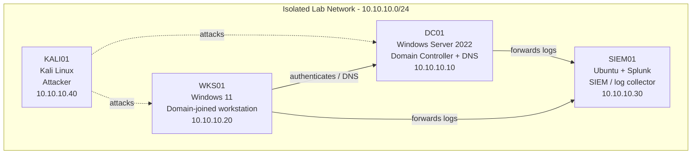

# Windows VM Capture Agent Setup

> Built and documented in an isolated home lab environment that I own.
> Documentation generated with LabScribe and reviewed by hand.

## 1. Overview

This session covered installing and configuring the Splunk Universal Forwarder on a Windows workstation (`WINDOWSBOX`) to forward Security, System, and Sysmon event logs to the lab's Splunk SIEM. The session included troubleshooting a failed Sysmon channel subscription, verifying forwarder input status, and confirming network reachability by reviewing interface configuration and adding an ICMP firewall allow rule for ping testing.

| Host | OS | Role | IP |
|---|---|---|---|
| DC01 | Windows Server 2022 | Domain Controller + DNS | 10.10.10.10 |
| WKS01 | Windows 11 | Domain-joined workstation | 10.10.10.20 |
| SIEM01 | Ubuntu + Splunk | SIEM / log collector | 10.10.10.30 |
| KALI01 | Kali Linux | Attacker box | 10.10.10.40 |

*Note: This session's transcripts reference host `WINDOWSBOX`, whose observed IPs (`10.0.2.15` NAT interface, `192.168.192.20` host-only interface) do not match the `10.10.10.0/24` lab addressing scheme above. It appears to be the same machine referred to as WKS01 elsewhere in the lab, but this is not confirmed by the transcript.*

## 2. Network Diagram

## 3. Build Steps

### WINDOWSBOX (Splunk Universal Forwarder / log source)

No screenshots were provided for this session — none appear in the raw material.

- **2026-08-05 11:47** — Ran the `splunkforwarder-10.4.2` MSI from the Downloads folder to install the Splunk Universal Forwarder, then opened `outputs.conf` in Notepad to point the forwarder at the SIEM's receiving port. This establishes the log-shipping pipeline from the Windows workstation to Splunk.
- Added three monitor stanzas via `splunk.exe add monitor`: `WinEventLog:Security`, `WinEventLog:System`, and `WinEventLog:Microsoft-Windows-Sysmon/Operational`. These are the core event sources needed for endpoint detection (authentication events, system health, and Sysmon process/network telemetry).
- All three `add monitor` commands failed with `Parameter name: Path must be a file or directory.` — this is expected/benign behavior for WinEventLog monitor stanzas added via CLI on this Splunk version; the stanzas still get written to config. Followed up by manually editing `inputs.conf` directly in Notepad to define the WinEventLog inputs.
- Restarted the `SplunkForwarder` service to apply the new `inputs.conf`.
- Verified configuration with `splunk.exe list monitor` (had to re-authenticate — session had expired) and `splunk.exe list inputstatus`, confirming the `Security` and `System` monitor consumed WinEventLog data via `splunk-winevtlog.exe` (`total bytes = 21933400`), while `Microsoft-Windows-Sysmon/Operational` did not appear as an active input.
- **2026-08-05 12:25** — Confirmed Sysmon's operational log exists (`Get-WinEvent -ListLog "*Sysmon*"`) and is enabled (`wevtutil gl`). Checked the forwarder service account (`SplunkForwarder` running as `NT SERVICE\SplunkForwarder`) and searched `splunkd.log` for Sysmon-related errors, finding a channel subscription failure (`errorCode=5`, access denied) when the forwarder tried to subscribe to the Sysmon channel. Restarted the service again as a first remediation attempt; the same error persisted in the log afterward, indicating the fix was not yet applied (see Troubleshooting Log).
- **2026-08-06 01:17** — Ran `ipconfig` to confirm network interfaces: a NAT adapter (`10.0.2.15`) and a host-only/second adapter (`192.168.192.20`). Added an inbound firewall rule (`New-NetFirewallRule -DisplayName "Allow ICMPv4-In"`) to permit ICMPv4 echo requests, enabling connectivity testing (ping) from other lab hosts such as the SIEM or DC for reachability verification.

### DC01, SIEM01, KALI01

*No activity captured for this section yet.*

## 4. Troubleshooting Log

| Issue | Cause | Fix |
|---|---|---|
| `splunk.exe add monitor` returned `Parameter name: Path must be a file or directory.` for all three WinEventLog monitors | The Universal Forwarder CLI's `add monitor` command expects a filesystem path, not a WinEventLog channel name — WinEventLog inputs need to be defined as stanzas in `inputs.conf` rather than added via this CLI syntax | Manually edited `inputs.conf` in Notepad to add the `[WinEventLog://...]` stanzas directly, then restarted the `SplunkForwarder` service to apply them |
| `splunk.exe list monitor` returned `Your session is invalid. Please login.` | CLI session token had expired between commands | Re-authenticated with `admin2` / `[REDACTED]` when prompted |
| Sysmon events not forwarding; `splunkd.log` showed `WinEventLogChannel::subscribeToEvtChannel: Could not subscribe to Windows Event Log channel 'Microsoft-Windows-Sysmon/Operational'` and `Init failed... errorCode=5` | Error code 5 is Windows "Access Denied" — the `SplunkForwarder` service account (`NT SERVICE\SplunkForwarder`) likely lacks permission to read the custom Sysmon operational channel, which by default restricts access to specific SIDs (per the `wevtutil gl` channelAccess output) | Restarted the `SplunkForwarder` service as an initial attempt; the same error still appeared in `splunkd.log` afterward, so the underlying permissions issue was **not yet resolved** as of end of session — likely needs the service account added to the Sysmon channel's `channelAccess` ACL or added to the "Event Log Readers" group |
| `ip config` command not recognized | Typed a Linux-style command (`ip config`) on Windows instead of the correct PowerShell/cmd equivalent | Re-ran with the correct Windows command, `ipconfig` |

## 5. Attack & Detection Scenarios

*No activity captured for this section yet.*

## 6. Lessons Learned

- WinEventLog inputs for the Splunk Universal Forwarder must be added via `inputs.conf` edits, not the `add monitor` CLI syntax, which is designed for file/directory paths.
- A Sysmon operational channel can be enabled and visible via `wevtutil`/`Get-WinEvent` while still being inaccessible to the Splunk forwarder service account due to channel ACL restrictions (errorCode=5) — the fix for this was still in progress at session end and needs to be revisited.
- Restarting the forwarder service alone did not resolve the Sysmon subscription failure, confirming the root cause is a permissions/ACL issue rather than a stale service state.
- Cross-checking `ipconfig` output early helped confirm which interface (NAT vs. host-only) the box uses for lab traffic, which will matter for firewall rules and Splunk output routing.

## 7. Changelog

- **2026-08-05 → 2026-08-06**: Installed Splunk Universal Forwarder on WINDOWSBOX; configured Security/System/Sysmon WinEventLog monitors; diagnosed and partially addressed a Sysmon channel subscription failure (errorCode=5, unresolved); verified network interfaces and added an inbound ICMPv4 firewall rule for connectivity testing.