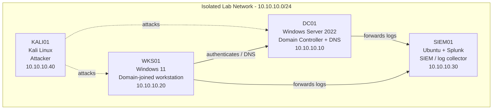

# Session: Simulating Attacks and Wazuh Filtering

> Built and documented in an isolated home lab environment that I own.
> Documentation generated with LabScribe and reviewed by hand.

## 1. Overview

This session focused on generating an SSH brute-force attack against the SIEM/Ubuntu host and confirming that the resulting authentication events were captured for analysis. Before the attack could be reviewed, Splunk on `soc-lab-ubuntu` was found stopped and had to be restarted. A brute-force run originating from `192.168.192.30` (the attacker box) was then observed in `/var/log/auth.log`, showing multiple failed SSH password attempts against user `socadmin` and at least one accepted login. Per the session note, the Hydra attack was successful and logs were received; rule authoring/filtering is deferred to the next session.

> Note: the lab template records the subnet as `10.10.10.0/24`, but the captured transcript shows activity on `192.168.192.x` (attacker `192.168.192.30`). IPs below reflect what was actually observed in the transcript.

| Host | OS | Role | IP |
|---|---|---|---|
| DC01 | Windows Server 2022 | Domain Controller + DNS | 10.10.10.10 |
| WKS01 | Windows 11 | Domain-joined workstation | 10.10.10.20 |
| SIEM01 | Ubuntu + Splunk | SIEM / log collector | 10.10.10.30 |
| KALI01 | Kali Linux | Attacker box | 10.10.10.40 |

## 2. Network Diagram

## 3. Build Steps

### SIEM01 (`soc-lab-ubuntu`, Ubuntu + Splunk)

1. **Checked Splunk service status.** The first attempt (`sudo splunk status`) failed because `splunk` is not on the system `PATH`; the full path `/opt/splunk/bin/splunk status` was used instead. Status reported `splunkd 3791 was not running`, and stale helper processes/PID file were cleaned up. This matters because no detection or search is possible while the SIEM daemon is down (see `VirtualBoxVM_VsrFQQ8cGt.png`).

2. **Restarted Splunk.** `sudo /opt/splunk/bin/splunk restart` emitted a deprecation warning about running as root, so the restart was reissued with `--run-as-root`. Preliminary checks passed (ports 8000/8089/8065/8191 open, indexes validated, installed files intact against the `splunk-10.4.2` manifest), new certs were generated, and the daemon came up. This confirms the Splunk web interface (`https://soc-lab-ubuntu:8000`) is available for review (see `VirtualBoxVM_pAzIVB5ApD.png`).

3. **Verified Splunk was running.** A follow-up `splunk status` reported `splunkd is running (PID: 6626)` with helper processes active — confirming the SIEM was ready to ingest/search before running the attack.

4. **Opened the SIEM web UI in the browser** to review incoming events / detection results — a browser capture was taken during this window (see `chrome_o8drOyn4Cf.png`).

5. **Reviewed raw authentication logs.** `sudo tail -50 /var/log/auth.log` was used to inspect SSH activity directly on the host. The tail showed the brute-force burst from `192.168.192.30` against `socadmin`, including repeated `Failed password` entries, one `Accepted password`, and the SSH server activating a rate-limit penalty (`srclimit_penalise`). This is the source-side evidence that the attack was recorded (see `VirtualBoxVM_PQnGIuQEHU.png`).

> Per the session note, the events were also observed on the Wazuh side ("Wazuh received logs, Ubuntu detected on its side"). The captured transcript itself only shows Splunk and raw `auth.log`; the Wazuh detection was noted but not captured in the terminal output.

### DC01 (Windows Server 2022)

*No activity captured for this section yet.*

### WKS01 (Windows 11)

*No activity captured for this section yet.*

### KALI01 (Kali Linux)

*No terminal activity captured from the attacker box this session; the Hydra brute force was observed only from the SIEM01 side (source `192.168.192.30`).*

## 4. Troubleshooting Log

| Issue | Cause | Fix |
|---|---|---|
| `sudo splunk status` → `sudo: 'splunk': command not found` | Splunk binary is not on the system `PATH` | Invoked Splunk using its full path, `/opt/splunk/bin/splunk` |
| `splunkd 3791 was not running`; stale PID file present | Splunk daemon had stopped; leftover PID/helper state from the prior run | Splunk's own start routine stopped stale helpers and removed the stale PID file, then a restart was issued |
| Restart warning: "Running Splunk Enterprise as root is deprecated…" | `splunk restart` was run under `sudo` (as root) without the expected flag | Re-ran the restart with `--run-as-root` to acknowledge and proceed |
| `WARNING: Server Certificate Hostname Validation is disabled` during web-server startup | `server.conf [sslConfig] cliVerifyServerName` is disabled (default/lab config) | Left as-is for the lab; noted as expected behavior, no functional impact |
| `mongod-8.0 … failed to open directory … cyrus-sasl-mongo-openssl3 … error: No such file or directory` | KV store (MongoDB) looked for a SASL plugin directory that does not exist in this build path | Non-fatal warning during startup; Splunk still reached running state (`splunkd is running (PID: 6626)`), so no action was required this session |

## 5. Attack & Detection Scenarios

| Scenario | Attack (KALI01) | Detection (SIEM01) | Status |
|---|---|---|---|
| SSH brute force against `socadmin` | Brute-force login attempts from `192.168.192.30` (appears to be a Hydra run per session note) | `/var/log/auth.log` shows multiple `Failed password` / `pam_unix(sshd:auth): authentication failure` entries and `srclimit_penalise` rate-limiting; one `Accepted password` login also recorded. Logs received by Splunk/Wazuh per note. | Attack successful (valid credential accepted); events captured. Detection rule authoring pending next session. |

## 6. Lessons Learned

- Splunk was down at the start of the session — verify `splunkd` is running (via `/opt/splunk/bin/splunk status`) *before* generating attack traffic, or events risk being missed.
- Use the full binary path `/opt/splunk/bin/splunk`; the `splunk` command is not on `PATH`.
- Running Splunk as root now requires `--run-as-root` and is deprecated — worth revisiting to run Splunk under a dedicated service account.
- SSH already applied a rate-limit penalty (`srclimit_penalise`) against the brute-force source, which itself is a useful detection signal alongside the failed-password events.
- The brute force succeeded (an `Accepted password` appears), which is a reminder to harden `socadmin` credentials / SSH auth in the lab.

## 7. Changelog

- **2026-08-06** — Restarted Splunk on SIEM01 after finding it stopped; ran an SSH brute-force attack from `192.168.192.30` against `socadmin` and confirmed the attempts were captured in `/var/log/auth.log` and received by the SIEM. Detection rule writing deferred to next session. Screenshots: `VirtualBoxVM_VsrFQQ8cGt.png`, `VirtualBoxVM_pAzIVB5ApD.png`, `chrome_o8drOyn4Cf.png`, `VirtualBoxVM_PQnGIuQEHU.png`.