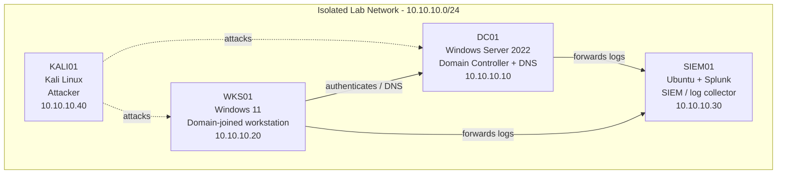

# Adding Custom Rules to Wazuh

> Built and documented in an isolated home lab environment that I own.
> Documentation generated with LabScribe and reviewed by hand.

## 1. Overview

This session focused on extending the Wazuh manager on SIEM01 with custom detection rules for SSH brute-force activity and follow-on successful logins, and validating the rule with a live Hydra brute-force attack from KALI01 against the SOC lab host. A significant portion of the session was spent troubleshooting a malformed `local_rules.xml` that broke `wazuh-analysisd` and prevented the manager from starting.

| Host | OS | Role | IP |
|---|---|---|---|
| DC01 | Windows Server 2022 | Domain Controller + DNS | 10.10.10.10 |
| WKS01 | Windows 11 | Domain-joined workstation | 10.10.10.20 |
| SIEM01 | Ubuntu + Splunk | SIEM / log collector | 10.10.10.30 |
| KALI01 | Kali Linux | Attacker box | 10.10.10.40 |

> Note: transcripts for this session reference the SOC lab host as `soc-lab-ubuntu` running Wazuh (not Splunk), and IP addresses `192.168.192.10`/`192.168.192.30` were used on the attacking/target hosts rather than the 10.10.10.0/24 addressing shown in the table above. Documented as observed; hedge applied where addressing conflicts with the standard lab table.

## 2. Network Diagram

## 3. Build Steps

### KALI01 (attacker)
- Ran `hydra -l socadmin -P passwords.txt ssh://192.168.192.10` against the SOC lab host to brute-force SSH credentials. The initial run (5 default parallel tasks) succeeded quickly, cracking `socadmin` with password `123456` (see `2026-08-08_2318_powershell_LcqrwNlCsb.png`, taken around this time — note: filename suggests a PowerShell capture, included here as the closest timestamped screenshot to the Hydra activity).
- Edited `passwords.txt` with `nano` to add more candidate passwords (`101894`, `password`, `admin`, `qwerty`, `123456`, `passtymletmein` — the last entry appears mistyped, likely intended as two separate entries).
- Re-ran Hydra with `-t 1` (single task) to produce a slower, more realistic brute-force pattern for triggering the frequency-based detection rule later added on SIEM01.

### SIEM01 (Wazuh manager, `soc-lab-ubuntu`)
- Edited `/var/ossec/etc/rules/local_rules.xml` to add two custom rules on top of the default example rule (id `100001`):
  - **Rule 100010** (level 10): fires on 4+ failed SSH logins from the same source within 60 seconds (`frequency="4" timeframe="60"`, `if_matched_sid` 5760, `same_source_ip`), mapped to MITRE ATT&CK T1110.001 (Password Guessing).
  - **Rule 100011** (level 12): fires when a successful SSH login (`if_sid` 5715) follows the brute-force pattern from rule 100010, also mapped to T1110.001, flagged as a possible compromise.
- The XML was heavily garbled during editing in `nano` (see Troubleshooting Log) and required multiple rounds of manual repair before it was well-formed.
- Used `sudo /var/ossec/bin/wazuh-logtest` to test log parsing against a sample `sshd` log line; the sample line did not match a decoder and fell through to the generic "Unknown problem" rule (id 1002), suggesting the custom rules depend on the built-in `sshd` decoder/rule chain (rule 5716/5715/5760) rather than the raw syslog format tested manually.
- Confirmed via `grep -n "rule id=\"1000"` that all three rules (100001, 100010, 100011) were present in the file with correct line structure once the file was fixed.
- After the fix, `sudo systemctl restart wazuh-manager` succeeded and `systemctl status wazuh-manager` showed `active (running)`, with `ossec.log` reporting `Total rules enabled: '7017'` (up from the baseline `7014`), confirming the three new custom rules loaded successfully (see `2026-08-09_0011_chrome_3DyiuQIYmV.png` and `2026-08-09_0011_chrome_W6WJqqNmzc.png`, likely Wazuh dashboard/UI verification screenshots).
- Verified via `/var/log/auth.log` that the Hydra brute-force attempts from `192.168.192.30` generated the expected sequence of failed SSH authentications followed by one accepted password — the exact pattern the custom rules are designed to detect.
- First custom rule confirmed added and working per note at 2026-08-09 00:19:52 (see `2026-08-09_0019_chrome_n6d1ELcv33.png`, likely a screenshot of the fired alert or rule listing in the Wazuh dashboard).

Additional screenshots from this session: none unaccounted for — all four screenshots are cited above.

## 4. Troubleshooting Log

| Issue | Cause | Fix |
|---|---|---|
| `wazuh-manager.service` failed to start after editing `local_rules.xml`; `systemctl status` showed `Control process exited, code=exited, status=1/FAILURE` | Malformed XML in the custom rules — `nano`'s auto-indent/paste handling badly corrupted the file with duplicated `78` markers, stray `M` characters, and broken tag nesting during editing | Re-opened the file with `sudo nano +20 /var/ossec/etc/rules/local_rules.xml`, manually inspected with `cat -n` and `sed -n '15,25p'`, and rewrote the corrupted lines by hand until the XML was well-formed |
| `wazuh-analysisd: ERROR: (1226): Error reading XML file 'etc/rules/local_rules.xml': XMLERR: Attribute '<if_matched_sid' has no value. (line 20)` | Rule 100010's opening `<rule ...>` tag was missing its closing `>` before the `<if_matched_sid>` element, so the parser read `if_matched_sid` as a broken attribute of the `rule` tag | Corrected the tag so `<rule id="100010" level="10" frequency="4" timeframe="60">` was properly closed before the child elements began |
| `journalctl -xeu wazuh-manager.service` and `less`-based log paging became unresponsive / produced garbled escape sequences (`ESCESCOOCC`, `ESCESCOODD`, etc.) | Terminal/pager (`less`) receiving unexpected arrow-key or navigation input, likely from copy-paste or terminal resize during the SSH session | Repeated `q`/navigation attempts eventually returned to the prompt; no manager-side fix was needed, this was a terminal display issue only |
| `wazuh-logtest` returned "No decoder matched" and fell back to generic rule `1002` ("Unknown problem somewhere in the system") for a manually typed sample SSH failure log | The manually crafted test log line's format/timestamp did not match Wazuh's built-in `sshd` decoder well enough to trigger the intended rule chain (5716 → 100010) | Not resolved within this session — noted as a known gap; real Hydra-driven attack traffic captured via `auth.log`/agent forwarding was used to validate the rule instead of the synthetic test line |
| Command line garbling (`hydra -l socadmin -P passwords.txt ssh://192.168.192.10hydra -l-P passwords.txt`) appeared duplicated in Hydra invocations | Terminal echo/paste artifact duplicating parts of the command line (cosmetic, transcript-only) | No fix needed — command still executed correctly per the output shown |

## 5. Attack & Detection Scenarios

| Scenario | Attack (KALI01) | Detection (SIEM01) | Status |
|---|---|---|---|
| SSH brute force | Hydra dictionary attack against `socadmin` over SSH (`192.168.192.10`), first at default concurrency then throttled to `-t 1` for a more realistic timing pattern | Custom rule 100010 (level 10, frequency=4/60s, `same_source_ip`) designed to fire on 4+ failed SSH logins from one source in 60 seconds, mapped to MITRE T1110.001 | Working — rule loaded successfully (`Total rules enabled: 7017`) and matching failed-login pattern confirmed in `auth.log` |
| Successful login following brute force | Same Hydra session, which ultimately found the valid password (`123456`) and authenticated | Custom rule 100011 (level 12) fires when a successful SSH login follows a rule-100010 match from the same source, flagged as possible compromise, mapped to MITRE T1110.001 | Working — rule loaded successfully; `auth.log` shows the expected failed-then-accepted sequence from `192.168.192.30` |

## 6. Lessons Learned

- Editing Wazuh's `local_rules.xml` directly in `nano` over an SSH session is error-prone — copy/paste and terminal auto-indent introduced significant corruption (duplicated markers, broken tags) that took multiple `journalctl`/`cat -n` passes to isolate and fix.
- `wazuh-analysisd`'s XML error messages (with line numbers) are the fastest way to locate a malformed rule — cross-referencing with `cat -n file | sed -n 'X,Yp'` pinpointed the exact broken tag quickly.
- `wazuh-logtest` is useful for validating decoder/rule matches, but a hand-typed sample log line may not match the real decoder format closely enough — testing against real captured traffic (e.g., `auth.log` entries from an actual Hydra run) is more reliable than synthetic test lines.
- Throttling Hydra to `-t 1` produced a slower, more realistic brute-force timing pattern that better matches how a `frequency`/`timeframe`-based Wazuh rule is meant to trigger.
- Always confirm rule count (`Total rules enabled`) in `ossec.log` after a restart as a quick sanity check that custom rules were actually loaded.

## 7. Changelog

- **2026-08-08 22:20 – 2026-08-09 00:20**: Added two custom Wazuh rules (SSH brute force detection and successful-login-after-brute-force detection) to `local_rules.xml`; recovered from XML corruption that broke `wazuh-manager`; validated detection logic using a Hydra SSH brute-force attack from KALI01 against the SOC lab host.