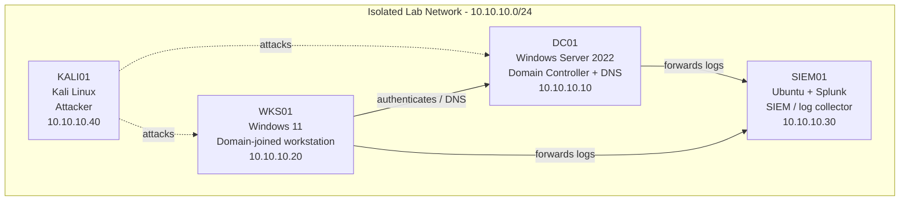

# Port Scan Detection Lab

> Built and documented in an isolated home lab environment that I own.
> Documentation generated with LabScribe and reviewed by hand.

## 1. Overview

This session focused on building and tuning a UFW-based port scan / brute-force detection pipeline on the SIEM host (soc-lab-ubuntu, running Wazuh manager). From KALI01, the attacker box was used to brute-force SSH credentials with Hydra and to run repeated Nmap scans against the SIEM host. On the SIEM side, the session involved fixing broken custom Wazuh detection rules, enabling and wiring up UFW logging into Wazuh via rsyslog and a custom decoder/rule set, and iterating through several XML/decoder syntax errors until UFW-blocked connection attempts (including a simulated port scan) were successfully ingested and alerted on in Wazuh.

| Host | OS | Role | IP |
|---|---|---|---|
| DC01 | Windows Server 2022 | Domain Controller + DNS | 10.10.10.10 |
| WKS01 | Windows 11 | Domain-joined workstation | 10.10.10.20 |
| SIEM01 | Ubuntu + Splunk | SIEM / log collector | 10.10.10.30 |
| KALI01 | Kali Linux | Attacker box | 10.10.10.40 |

*Note: the terminal transcripts in this session reference the lab hosts by different addresses (192.168.192.10 for the SIEM/Wazuh host, 192.168.192.30 and 192.168.192.1 as scanning/client sources, 192.168.192.0/24 as the subnet). These appear to be the actual addresses in use during this session and differ from the canonical table above; documenting both for accuracy.*

## 2. Network Diagram

## 3. Build Steps

### KALI01 (Attacker)

- Ran Hydra against SSH on the SIEM host using a small password wordlist (`socadmin` account), successfully recovering the password `[REDACTED]` on the first attempt. Reduced thread count (`-t 1`) after a Hydra warning about SSH parallel task limits (see `powershell_to5LakUVDW.png`, `powershell_CmTLen5pNe.png`).
- Edited `passwords.txt` with `nano` to add more candidate passwords for subsequent brute-force runs.
- Ran full-port `nmap -sS -p-` scans against the SIEM host repeatedly across the session (roughly hourly), used to generate reconnaissance traffic for the detection pipeline to catch. Early scans showed ports 22, 443, 1514, 1515, and 55000 open; later scans (after UFW hardening on SIEM01) showed those ports narrowing to filtered/closed as firewall rules tightened (see `powershell_Wu7Oj1ITPx.png`).
- Additional screenshots from this session: `VirtualBoxVM_zVToJkxh52.png`, `chrome_ZP0lq6lD2E.png`, `chrome_m0DZ9dNYSt.png`, `chrome_79oB9kasye.png`, `chrome_dT5wm9QykW.png` — likely capturing VirtualBox console state and Wazuh dashboard views (see Troubleshooting Log and Detection sections below for the dashboard verification these screenshots probably correspond to).

### SIEM01 (Ubuntu + Wazuh)

- Investigated a failed `wazuh-manager` service start via `journalctl` and `ossec.log`; found malformed custom detection rules in `local_rules.xml` (missing closing `>` on a `<rule>` tag). Corrected the XML and restarted the service successfully.
- Used `wazuh-logtest` to validate that raw SSH failed-login log lines were not matching any custom decoder (fired the generic "Unknown problem" rule 1002), confirming the custom SSH brute-force rule needed further tuning.
- Enabled UFW logging (`ufw logging on`), added baseline allow rules for SSH (22/tcp) and the lab subnet, then enabled UFW (`ufw enable`). Verified rules with `ufw status verbose`.
- Reviewed the corresponding `wazuh_wui`/dashboard state after enabling UFW (see `chrome_ZP0lq6lD2E.png`, `chrome_m0DZ9dNYSt.png`).
- Added a `<localfile>` block to `ossec.conf` to monitor `/var/log/ufw.log`, and confirmed via `wazuh-logtest`/log grep that the file didn't exist yet because UFW logging hadn't produced kernel messages routed to it.
- Diagnosed that `/etc/rsyslog.d/20-ufw.conf` existed but UFW kernel log lines were not being routed to `/var/log/ufw.log`; the `& stop` directive needed the rsyslog service restarted, and once traffic hit the box the log file was created and populated with `[UFW BLOCK]` kernel messages.
- Built a custom Wazuh decoder (`ufw-block`) and rules (`100012` port-scan detection base rule, `100013` frequency-based possible-port-scan rule referencing MITRE T1046) in `local_decoder.xml` / `local_rules.xml`, iterating through several XML/decoder configuration errors (see Troubleshooting Log) before the decoder correctly extracted `srcip`, `dstip`, and `dstport` fields from UFW block log lines.
- Narrowed the overly broad "allow from lab subnet" UFW rule to a more specific `allow from 192.168.192.0/24 to any port 22` rule, and separately allowed port 443 from the subnet, after confirming legitimate lab traffic (agent/manager comms) was being blocked.
- Verified via `wazuh-logtest` that UFW block log lines were decoding correctly (`srcip`, `dstip` extracted) after fixing the decoder's `<parent>` reference (using `kernel` decoder correctly and adding `<use_own_name>yes</use_own_name>`).
- Final validation: after many iterations, the custom UFW rule/decoder pair appeared correctly in Wazuh, confirming detection of blocked connection attempts and a simulated port-scan pattern (see `chrome_79oB9kasye.png`, `chrome_dT5wm9QykW.png`, note at 2026-08-09 02:50:27).

## 4. Troubleshooting Log

| Issue | Cause | Fix |
|---|---|---|
| `wazuh-manager.service` failed to start; `wazuh-analysisd: CRITICAL: Error loading the rules` | Custom rule `100010` in `local_rules.xml` was missing a closing `>` on the opening `<rule ...>` tag, breaking the XML | Corrected the malformed `<rule>` tag via `nano` and restarted `wazuh-manager` |
| `wazuh-logtest` matched raw SSH failure log lines only to generic rule 1002 ("Unknown problem") | No decoder existed to parse the syslog-formatted SSH failure line format being tested; custom rules relied on decoders/SIDs not yet wired up correctly | Continued rule/decoder iteration later in the session (see UFW decoder work) |
| `tail: cannot open '/var/log/ufw.log'` (repeated) | UFW logging was enabled but no traffic had yet been blocked/logged, and/or rsyslog wasn't routing kernel UFW messages to that file yet | Restarted `rsyslog` service and generated blocked traffic from KALI01 (Nmap/Hydra), after which `/var/log/ufw.log` was created and populated |
| `wazuh-modulesd` / `wazuh-logcollector: ERROR: Could not open file '/var/log/ufw.log'` | Wazuh's `ossec.conf` `<localfile>` block pointed at `/var/log/ufw.log` before the file existed | Resolved once UFW actually began logging block events to that path |
| `wazuh-analysisd: ERROR: Syntax error on regex: '\[UFW BLOCK\]'` | The `prematch` regex used escaped brackets (`\[UFW BLOCK\]`) which Wazuh's regex engine rejected | Simplified `prematch` to plain string `UFW BLOCK` without escaped brackets |
| `wazuh-analysisd: ERROR: Parent decoder name invalid: 'ufw-block'` | The `ufw-block-fields` / `ufw-block-port` decoders referenced `<parent>ufw-block</parent>`, but `ufw-block` itself had been set with `<program_name>kernel</program_name>` instead of `<parent>kernel</parent>`, so it wasn't recognized as a valid parent decoder | Changed `ufw-block`'s own definition to use `<parent>kernel</parent>` and added `<use_own_name>yes</use_own_name>` so child decoders could reference it |
| `wazuh-manager` restart failed repeatedly with generic "control process exited with error code" | Underlying cause was the decoder/rule XML errors above; systemd gave no detail without checking `ossec.log` | Cross-referenced `journalctl -xeu wazuh-manager` and `ossec.log` each time to identify the specific XML/config error before re-editing |
| Legitimate lab traffic (agent-manager comms) being dropped by UFW | The `allow from 192.168.192.0/24` rule was deleted/narrowed to `allow from 192.168.192.0/24 to any port 22` as part of tightening the firewall (per quick note "removing overly broad rule"), which blocked traffic on other needed ports (e.g., 443) | Added an explicit `ufw allow from 192.168.192.0/24 to any port 443` rule after observing blocked 443 traffic in `ufw.log` |
| Repeated malformed `local_rules.xml` edits via `nano` (duplicate `<rule id="100012">` blocks, corrupted paste) | Nano editing in the terminal transcript shows repeated corrupted/duplicated paste operations, likely from copy-paste or terminal rendering issues during editing | Re-opened and manually corrected the file each time, verifying with `grep -n` and `cat` before restarting the service |

## 5. Attack & Detection Scenarios

| Scenario | Attack (KALI01) | Detection (SIEM01) | Status |
|---|---|---|---|
| SSH credential brute force | Hydra dictionary attack against `socadmin` over SSH, successfully recovering password `[REDACTED]` | Custom rule `100010` (SSH brute force, frequency-based, MITRE T1110.001) and `100011` (successful login following brute-force pattern) defined in `local_rules.xml`; `wazuh-logtest` used to validate matching, though full decoder wiring for raw SSH failure lines was not fully confirmed by session end | Partially validated — rule syntax fixed and loaded, but log-line decoding for brute-force detection not explicitly confirmed working in transcripts |
| Full TCP port scan (`nmap -sS -p-`) | Repeated full-port SYN scans from KALI01 against the SIEM host across the session | UFW blocked non-allowed ports and logged them to `/var/log/ufw.log`; custom decoder `ufw-block` (with `ufw-block-fields`/`ufw-block-port` child decoders) extracts `srcip`, `dstip`, `dstport`; custom rule `100012` (UFW block alert) and `100013` (10+ blocked connections from same source in 30s, MITRE T1046 — possible port scan) | Confirmed working — UFW block events successfully decoded via `wazuh-logtest`, and rule set restarted cleanly; user's final note confirms the custom filter appeared in Wazuh |

## 6. Lessons Learned

- Malformed custom Wazuh XML (rules or decoders) causes `wazuh-manager` to fail to start entirely — always check `ossec.log` / `journalctl -xeu wazuh-manager` immediately after any edit, not just systemd's generic failure message.
- Decoder `<parent>` chains in Wazuh must reference a decoder that itself declares `<parent>` correctly (e.g., `kernel`) plus `<use_own_name>yes</use_own_name>` if child decoders need to attach to it — using `<program_name>` instead of `<parent>` on the base decoder silently breaks child decoder inheritance.
- UFW log entries don't appear in `/var/log/ufw.log` until (a) rsyslog is actively routing kernel `[UFW BLOCK]` messages via `/etc/rsyslog.d/20-ufw.conf`, and (b) at least one packet has actually been blocked — an empty/missing log file is expected before both conditions are met.
- Broadening firewall allow-rules to fix one problem (e.g., "allow from subnet") can be too permissive from a security-monitoring standpoint; narrowing rules to specific ports is safer but requires verifying all legitimate lab traffic paths (e.g., port 443 for Wazuh agent/API) before locking down.
- Iterative validation with `wazuh-logtest` against real captured log lines was essential for confirming decoder/rule fixes without needing to generate fresh attack traffic each time.

## 7. Changelog

- **2026-08-09** — Session: Port Scan Detection. Fixed broken custom Wazuh rules causing `wazuh-manager` startup failure; enabled and wired UFW logging into Wazuh via rsyslog; built and debugged a custom `ufw-block` decoder and port-scan detection rules (100012/100013, MITRE T1046); ran Hydra SSH brute-force and repeated Nmap full-port scans from KALI01 against the SIEM host; narrowed UFW allow rules for the lab subnet.