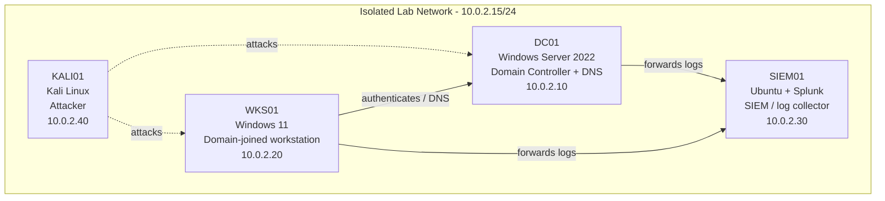

# SOC Home Lab — SIEM Host Build (soc-lab-ubuntu)

> Built and documented in an isolated home lab environment that I own.
> Documentation generated with LabScribe and reviewed by hand.

## 1. Overview

Day 1 of building the Linux SIEM host for the isolated SOC lab. All work this session happened on a single Ubuntu server VM, `soc-lab-ubuntu` (user `socadmin`), running in VirtualBox. The machine was fully patched (`apt update` / `apt upgrade`, 37 packages upgraded, new initramfs generated for kernel `7.0.0-28-generic`), then the Wazuh 4.12.0 all-in-one installation assistant was downloaded and run. The installer refused to proceed on the first attempt because the VM did not meet the 4 GB RAM / 2 CPU core minimum, so it was re-run with the `-i` flag to bypass the hardware check. The install completed through indexer, manager, Filebeat, and dashboard, but on the follow-up health check both `wazuh-indexer` and `wazuh-manager` were in a **failed** state and the dashboard was up but unable to reach OpenSearch on `127.0.0.1:9200`. Root cause appears to be the under-provisioned VM (3.3 GiB total RAM against an indexer that peaked at 1.5 GiB before dying). The session ended with the RAM doubled and the fault still open — no log sources onboarded and no detections built yet.

> **Note on the SIEM platform:** the reference diagram below labels SIEM01 as "Ubuntu + Splunk". This session actually deployed **Wazuh 4.12.0** (indexer + manager + dashboard) on the Ubuntu host. The diagram is reproduced as-is; the platform label should be reconciled in a later session.

| Host | OS | Role | IP |
|---|---|---|---|
| DC01 | Windows Server 2022 | Domain Controller + DNS | 10.0.2.10 *(planned — not touched this session)* |
| WKS01 | Windows 11 | Domain-joined workstation | 10.0.2.20 *(planned — not touched this session)* |
| SIEM01 (`soc-lab-ubuntu`) | Ubuntu Server (`resolute`, kernel 7.0.0-28-generic) | SIEM / log collector — Wazuh 4.12.0 all-in-one | 10.0.2.30 *(per diagram; not confirmed in transcript)* |
| KALI01 | Kali Linux | Attacker box | 10.0.2.40 *(planned — not touched this session)* |

## 2. Network Diagram

## 3. Build Steps

### SIEM01 — `soc-lab-ubuntu` (Ubuntu Server)

1. **Patched the base OS** (`sudo apt update && sudo apt upgrade -y`, 22:40–~22:42 UTC).
   37 packages were upgraded (592 MB downloaded), including `base-files`, `iproute2`, `libgcrypt20`, `apport`, `fwupd`, `packagekit`, and the full `linux-firmware-*` set. `dracut` regenerated `/boot/initrd.img-7.0.0-28-generic`.
   *Why it matters:* a SIEM box is the thing you trust to tell you the truth about the rest of the network — it should be fully patched before anything else is layered on top of it. Patching first also removes "stale package" as a variable when the SIEM stack later misbehaves.
   Two packages (`python3-software-properties`, `software-properties-common`) were held back due to phased updates, and an older kernel series (`7.0.0-14`) was flagged as auto-removable — both left as-is.

2. **Downloaded the Wazuh installation assistant** (22:42 UTC):
   `curl -sO https://packages.wazuh.com/4.12/wazuh-install.sh`
   *Why it matters:* the all-in-one assistant deploys indexer, manager, Filebeat, and dashboard on one host with generated certificates, which is the right shape for a small single-box lab SIEM.

3. **First install attempt failed the pre-flight check** — `sudo bash wazuh-install.sh -a` aborted with `ERROR: Your system does not meet the recommended minimum hardware requirements of 4Gb of RAM and 2 CPU cores.` See the Troubleshooting Log.

4. **Re-ran the installer bypassing the hardware gate** (22:48 UTC): `sudo bash wazuh-install.sh -a -i`. Progression logged by the assistant:
   - Dependencies installed (`apt-transport-https`, `debhelper`), Wazuh repository added.
   - Configuration files and the full certificate chain generated (root CA, admin, indexer, Filebeat, dashboard) and bundled into `wazuh-install-files.tar` — this archive holds the cluster key, certificates, and credentials, so it must be stored securely and never committed to the repo. Credentials themselves are `[REDACTED]` here.
   - Wazuh indexer installed, started, and cluster security settings initialized (22:49–22:50).
   - Wazuh manager installed and started (22:50–22:53); vulnerability detection configuration completed.
   - Filebeat installed, configured, and started (22:53).
   - Wazuh dashboard installation begun (transcript truncated at 22:53).
   *Why it matters:* this is the pipeline the whole lab depends on — agents → manager → Filebeat → indexer → dashboard. Knowing which stage the assistant reached makes the later failures much easier to localize.

5. **Post-install health check** (00:37–00:45 UTC, after a reboot — services show start times of ~00:36–00:38):
   - `systemctl status wazuh-indexer` → **failed** (exit code 1, Mem peak 1.5 G, CPU 23.2 s).
   - `systemctl status wazuh-manager` → **failed** (exit code 1, Mem peak 254.3 M).
   - `systemctl status wazuh-dashboard` → **active (running)**, but logging `[ConnectionError]: connect ECONNREFUSED 127.0.0.1:9200` every ~2 seconds.
   - `free -h` → total **3.3 GiB** RAM, 3.8 GiB swap.
   *Why it matters:* the dashboard being "green" while the indexer is dead is exactly the kind of false comfort a SOC analyst has to learn to distrust — always verify the data tier, not just the UI.

6. **Pulled indexer logs** (`sudo journalctl -u wazuh-indexer -n 50 --no-pager`, 00:45 UTC), which showed a Lucene/OpenSearch cluster-state flush stack trace followed by `fatal error in thread [opensearch[node-1][scheduler][T#1]], exiting` and `java.lang.NoClassDefFoundError: Could not initialize class com.sun.jna.Native`. Full detail was pointed at `/var/log/wazuh-indexer/wazuh-cluster.log` (not yet read).

7. **Increased VM memory in VirtualBox** — per the 19:50 note, RAM was doubled after the session's troubleshooting. The two captures `VirtualBoxVM_2DtOzJSqSe.png` and `VirtualBoxVM_NF0gdqKEyN.png` appear to be VirtualBox console/settings screenshots taken around this work; exact contents unverified.

8. Two further capture sessions were started at 00:47 and 00:50 UTC (`2026-08-03_0047_soc-lab-ubuntu.txt`, `2026-08-03_0050_soc-lab-ubuntu.txt`) but recorded no commands or output.

*Nothing was configured on DC01, WKS01, or KALI01 this session.*

## 4. Troubleshooting Log

| Issue | Cause | Fix |
|---|---|---|
| `WARNING: The current system does not match with the list of recommended systems.` on both installer runs | The VM runs Ubuntu `resolute`, which is newer than the assistant's supported list (Ubuntu 16.04–22.04, RHEL 7/8/9, CentOS 7/8, Amazon Linux 2) | Accepted the warning and continued. Worth flagging as a candidate contributor to the later indexer JVM/JNA failure; a supported LTS release may be the cleaner long-term fix |
| `ERROR: Your system does not meet the recommended minimum hardware requirements of 4Gb of RAM and 2 CPU cores.` — installer aborted | VM provisioned with ~3.3 GiB RAM (confirmed later by `free -h`), below the 4 GB minimum | Re-ran as `sudo bash wazuh-install.sh -a -i` to ignore the hardware check (`WARNING: Hardware checks ignored.`). This unblocked the install but did not solve the underlying shortage — it deferred the failure to runtime |
| `-i: command not found` and `i: command not found` | The `-i` flag was typed on its own at the shell prompt instead of being appended to the installer command | Re-issued the complete command with the flag attached: `sudo bash wazuh-install.sh -a -i` |
| `wazuh-indexer.service` — `Active: failed (Result: exit-code)`, `status=1/FAILURE`, Mem peak 1.5 G | Indexer (OpenSearch/JVM) died during startup. Given 3.3 GiB total RAM and a 1.5 GiB peak, memory pressure is the leading suspect | **Open.** RAM doubled in VirtualBox at end of session; restart and re-check not yet captured |
| `wazuh-manager.service` — `Active: failed (Result: exit-code)`, `status=1/FAILURE` | Likely collateral from the indexer failure and/or the same resource constraint; the manager has nowhere to ship alerts when the indexer is down | **Open.** Re-test after the indexer is healthy |
| Dashboard log spam: `[ConnectionError]: connect ECONNREFUSED 127.0.0.1:9200` (repeating every ~2 s) | `wazuh-dashboard` is running, but the indexer it queries on port 9200 is dead — nothing is listening | Symptom, not root cause. Will clear once `wazuh-indexer` starts successfully |
| `journalctl` indexer trace: Lucene `IndexingChain.flush` / `PersistedClusterStateService` stack, then `fatal error in thread [opensearch[node-1][scheduler][T#1]], exiting` and `java.lang.NoClassDefFoundError: Could not initialize class com.sun.jna.Native` | The JNA native library failed to initialize — commonly caused by insufficient memory, a `noexec` mount on the JNA temp directory, or a JDK/OS mismatch on an unsupported distro release. Cannot be narrowed further from the captured output | **Open.** Next step is reading `/var/log/wazuh-indexer/wazuh-cluster.log` as the log itself instructs, plus checking `/tmp` mount options and JVM heap settings |
| `systemctl status` output got stuck in the pager; stray keystrokes produced `No previous regular expression`, `Log file is already in use`, and repeated `...skipping...` | Default `less` pager on a raw TTY; arrow/escape sequences were interpreted as pager commands | Used `--no-pager` on the follow-up `journalctl` call, which produced clean, readable output |
| `apt upgrade` reported `Not upgrading yet due to phasing: python3-software-properties, software-properties-common`, and flagged the `linux-*-7.0.0-14` kernel set plus `pollinate` as no longer required | Normal Ubuntu phased-update behaviour and leftover packages from a previous kernel | No action taken. Left deliberately; `sudo apt autoremove` can reclaim space later once the SIEM stack is stable |

## 5. Attack & Detection Scenarios

| Scenario | Attack (KALI01) | Detection (SIEM01) | Status |
|---|---|---|---|

*No activity captured for this section yet — the SIEM stack is not yet healthy and no agents have been enrolled.*

## 6. Lessons Learned

- Bypassing an installer's hardware pre-flight check with `-i` doesn't remove the constraint, it just moves the failure from install time to runtime. The 4 GB minimum was real: the indexer peaked at 1.5 GiB on a 3.3 GiB box and died.
- A green service light on the presentation layer means nothing about the data layer. `wazuh-dashboard` reported `active (running)` while the indexer behind it was dead — the `ECONNREFUSED 127.0.0.1:9200` loop was the only honest signal.
- Check every tier of the pipeline explicitly (indexer → manager → Filebeat → dashboard), not just the one with a web UI.
- `journalctl --no-pager` is the right call on a bare TTY; fighting `less` wasted time mid-troubleshoot.
- Running a security stack on a distro release outside the vendor's supported list is a variable worth eliminating early, especially when the failure mode is a native-library load error.
- `wazuh-install-files.tar` contains the cluster key, certificates, and passwords. It must stay off the repo and out of screenshots.

## 7. Changelog

- **2026-08-02 → 2026-08-03 (Day 1, SIEM host):** Patched `soc-lab-ubuntu` (37 packages, new initramfs for kernel 7.0.0-28-generic). Downloaded and ran the Wazuh 4.12.0 all-in-one installation assistant; first run blocked by the 4 GB RAM / 2 core minimum, re-run with `-i` to bypass. Installer completed indexer, manager, Filebeat, and dashboard stages with generated certificates. Post-reboot health check found `wazuh-indexer` and `wazuh-manager` in a failed state and the dashboard unable to reach OpenSearch on 9200; indexer journal shows a JNA `NoClassDefFoundError` and a fatal scheduler-thread error. VM RAM doubled in VirtualBox at end of session; fault remains open pending review of `/var/log/wazuh-indexer/wazuh-cluster.log`. No agents onboarded, no detections built.