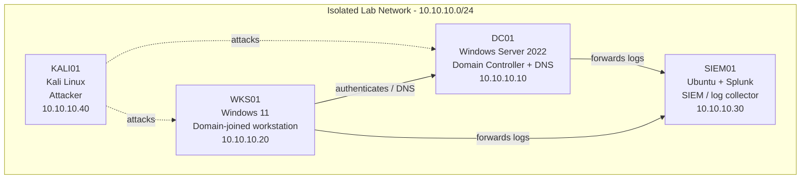

# Wazuh Correlation Rules for Brute Force

> Built and documented in an isolated home lab environment that I own.
> Documentation generated with LabScribe and reviewed by hand.

## 1. Overview

This session focused on the SIEM01 (Wazuh manager) host, verifying that Wazuh manager and dashboard services were healthy after a restart, and beginning work on a custom correlation rule in `local_rules.xml` intended to detect SSH brute-force activity (based on the default sshd "Failed" auth rule, sid `5716`). No attack traffic was generated from KALI01 during this session — the work was limited to SIEM-side configuration and service verification.

| Host | OS | Role | IP |
|---|---|---|---|
| DC01 | Windows Server 2022 | Domain Controller + DNS | 10.10.10.10 |
| WKS01 | Windows 11 | Domain-joined workstation | 10.10.10.20 |
| SIEM01 | Ubuntu + Splunk | SIEM / log collector | 10.10.10.30 |
| KALI01 | Kali Linux | Attacker box | 10.10.10.40 |

## 2. Network Diagram

## 3. Build Steps

**SIEM01 (soc-lab-ubuntu — Wazuh manager, note: this session's transcript refers to the host running Wazuh, which sits alongside/on the SIEM01 role in this lab)**

1. Confirmed `wazuh-manager` service was active and running via `systemctl status wazuh-manager`, showing all core daemons (analysisd, remoted, logcollector, syscheckd, modulesd, etc.) started successfully as of 02:06:14 UTC.
2. Cross-checked service health with `wazuh-control status`, confirming the expected daemons were running. Optional components (`wazuh-clusterd`, `wazuh-maild`, `wazuh-agentlessd`, `wazuh-integratord`, `wazuh-dbd`, `wazuh-csyslogd`) were confirmed not running, which is expected for this single-node lab setup.
3. Restarted `wazuh-manager` (`systemctl restart wazuh-manager`) to ensure a clean state before rule changes — a common step before validating new correlation rules so they load against a fresh analysisd process.
4. Verified `wazuh-dashboard` was active and listening, confirming the web UI would be reachable for reviewing alerts generated by the new rule later.
5. Verified port 443 was bound to the dashboard's `node` process using `ss -tulnp`, confirming the dashboard is reachable over HTTPS as expected.
6. Opened `/var/ossec/etc/rules/local_rules.xml` in `nano` to begin authoring a custom correlation rule. Work in progress: a draft rule (id `100001`, level `5`) was scaffolded off the built-in sshd "Failed" rule (`sid 5716`), intended to match repeated failed SSH logins as the basis for a brute-force detection rule (source IP field visible mid-edit, not yet complete at end of session).

No screenshots were captured during this session.

## 4. Troubleshooting Log

| Issue | Cause | Fix |
|---|---|---|
| `sudo systemctl starttus wzazuh-dashoboard` — command contains obvious typos (`starttus`, `wzazuh-dashoboard`) | Fat-fingered command while checking dashboard service status | Despite the typo, valid `wazuh-dashboard` status output was returned in the transcript, suggesting the correct command was actually run (or corrected via shell history/tab-completion) before the output shown; worth re-running cleanly next session to confirm |
| `sudo ss -tulnp \| grep 4p 4p 3p ^?p p p p p 443` — garbled grep pattern | Likely terminal input corruption/typos while trying to filter for port 443 | Correct listening-socket output for port 443 still appeared, so the underlying `ss` command succeeded; the malformed `grep` pattern didn't prevent the intended check, but should be retyped cleanly to avoid a false negative in future runs |
| `sudo nano /var/ossec/etc/rules/lovcal_rules.xml` — filename typo'd as `lovcal_rules.xml` | Typo when specifying the local rules file path | Nano opened the correct, existing `/var/ossec/etc/rules/local_rules.xml` (shown in the editor's title bar), indicating either shell/path completion resolved it or the intended file was reached regardless — confirm the correct file was saved to before trusting rule changes persist |

## 5. Attack & Detection Scenarios

*No attack traffic was generated in this session. The custom brute-force correlation rule (`local_rules.xml`, rule id 100001) was drafted but not yet completed, deployed, or tested against live SSH failed-login attempts from KALI01.*

## 6. Lessons Learned

- Restarting `wazuh-manager` before testing new local rules helps ensure `analysisd` picks up rule file changes cleanly.
- The lab's Wazuh install runs the dashboard directly on port 443 via its bundled Node process — useful to remember when checking for port conflicts.
- Several commands in this session had visible typos that didn't stop the intended check from working (likely due to shell history reuse or file/tab completion); good habit going forward to re-run key verification commands cleanly and confirm the actual command executed matches what's documented.
- The custom correlation rule is still in draft form (based on sid `5716`) — needs to be finished, validated with `wazuh-logtest`, and then tested against real failed SSH attempts before being considered part of the detection baseline.

## 7. Changelog

- **2026-08-06** — Verified Wazuh manager and dashboard service health on SIEM01; restarted `wazuh-manager`; began drafting a custom brute-force correlation rule in `local_rules.xml` (rule id 100001, based on sshd sid 5716). No attack/detection testing performed this session.