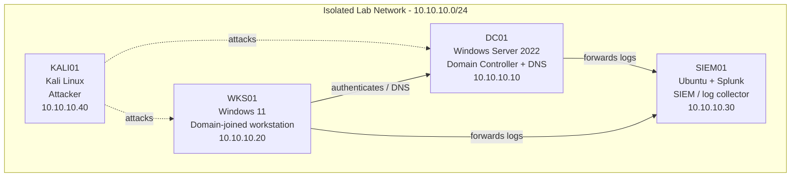

# Home SOC Lab — Session: Splunk Installation & HTTPS Setup

> Built and documented in an isolated home lab environment that I own.
> Documentation generated with LabScribe and reviewed by hand.

## 1. Overview

This session (2026-08-05, 00:53–12:23 UTC) was spent bringing the Ubuntu SIEM host (`soc-lab-ubuntu`) online as a Wazuh manager, enrolling the Windows 11 lab VM as agent `001` (`WIN11-LAB`), and re-addressing the host-only lab interface so manager and agent shared a routable lab subnet. Most of the captured work is Wazuh manager service verification, listener checks on TCP 1514/1515, agent registration via `manage_agents`, and a netplan change that gave `enp0s8` a static address of `192.168.192.10/24`. The user's notes record two milestones: Windows logs arriving in Wazuh at 02:29, and Splunk successfully receiving forwarded logs at 12:20. The Splunk installation and HTTPS work referenced in the session title is only evidenced by the browser screenshots and those notes — no Splunk terminal output was captured, so that portion is documented at a high level only. The third transcript (`2026-08-05_1627_soc-lab-ubuntu.txt`) is empty.

| Host | OS | Role | IP |
|---|---|---|---|
| DC01 | Windows Server 2022 | Domain Controller + DNS | 10.10.10.10 |
| WKS01 | Windows 11 | Domain-joined workstation | 10.10.10.20 |
| SIEM01 | Ubuntu + Splunk | SIEM / log collector | 10.10.10.30 |
| KALI01 | Kali Linux | Attacker box | 10.10.10.40 |

**Addressing actually observed in this session** (recorded separately, since it differs from the canonical table above):

| Host (as seen) | Interface | Address | Notes |
|---|---|---|---|
| `soc-lab-ubuntu` (Wazuh manager / SIEM) | `enp0s3` | `10.0.2.15/24` (DHCP, later `10.0.3.15/24` early in the session) | NAT-style uplink; address changed between transcripts |
| `soc-lab-ubuntu` | `enp0s8` | `192.168.192.10/24` (static, set this session) | Lab-facing / host-only interface |
| `WIN11-LAB` (Wazuh agent 001) | — | Registered as `10.0.3.15`, later seen connecting from `192.168.192.20` | Address mismatch caused the rejected-message errors below |

## 2. Network Diagram



## 3. Build Steps

### SIEM01 — `soc-lab-ubuntu` (Ubuntu + Wazuh manager, later Splunk)

**VirtualBox / VM preparation (early session, ~01:00–02:00)**
Two VirtualBox screenshots were taken before any terminal capture began; based on timing they appear to cover VM/adapter setup for the lab VMs, which is what made the later host-only addressing work possible (see `VirtualBoxVM_PhpVVBxto0.png`, `VirtualBoxVM_OzrjpDAivu.png`). No transcript exists for this window, so the exact changes are not documented.

**Wazuh manager service verification (03:56–03:58)**
Restarted and inspected `wazuh-manager`. The unit came up `active (running)` with all expected daemons present (`wazuh-authd`, `wazuh-remoted`, `wazuh-analysisd`, `wazuh-syscheckd`, `wazuh-logcollector`, `wazuh-monitord`, `wazuh-modulesd`, `wazuh-db`, `wazuh-execd`, plus the API workers). Confirming the full daemon set matters because agent enrollment needs `wazuh-authd` (1515) and agent traffic needs `wazuh-remoted` (1514) — if either is missing, agents silently fail to report.

**Version check**
`/var/ossec/bin/wazuh-control info` reported `WAZUH_VERSION="v4.12.0"`, `WAZUH_REVISION="rc1"`, `WAZUH_TYPE="server"`. Recording the exact build matters when matching agent packages to the manager.

**Firewall / listener checks**
Added `ufw allow 1514/tcp` and `ufw allow 1515/tcp` ("Rules updated" / "Rules updated (v6)"), then `ufw status` returned `Status: inactive` — so the rules are staged but not enforcing anything yet. `iptables -L -n | grep -E '1514|1515'` returned nothing, confirming no host-level block. Listener state was verified with `ss`:

```
tcp LISTEN 0 128 0.0.0.0:1515 users:(("wazuh-authd",pid=3969,fd=3))
tcp LISTEN 0 128 0.0.0.0:1514 users:(("wazuh-remoted",pid=4041,fd=4))
```

**Remote block configuration check**
`grep -A 5 "<remote>" /var/ossec/etc/ossec.conf` confirmed the manager is configured for `secure` connections on port `1514/tcp` with a `queue_size` of `131072`. This is the setting the Windows agent's `ossec.conf` must match.

**Agent enrollment — `WIN11-LAB` (04:38–04:48)**
`manage_agents -l` initially reported `** No agent available. You need to add one first.` The agent was then added through the interactive `manage_agents` menu (name `WIN11-LAB`, IP `10.0.3.15`), producing `Agent added with ID 001.` The enrollment key was extracted via the `(E)xtract` option — key value `[REDACTED]`. Manager logs confirm the flow:

```
2026/08/05 04:48:12 wazuh-authd: INFO: Agent key generated for agent 'WIN11-LAB' (requested locally)
2026/08/05 04:48:15 wazuh-remoted: INFO: (1409): Authentication file changed. Updating.
2026/08/05 04:48:15 wazuh-remoted: INFO: (1410): Reading authentication keys file.
```

A subsequent `manage_agents -l` showed `ID: 001, Name: WIN11-LAB, IP: 10.0.3.15`. This step is the whole point of the manager: without a key pair, `wazuh-remoted` drops the agent's traffic as unknown.

**Static lab addressing on `enp0s8` (06:34–06:45)**
`ip a` showed `enp0s8` up but with only a link-local IPv6 address — no IPv4 — while `enp0s3` had moved to `10.0.2.15/24`. `/etc/netplan/00-installer-config.yaml` was edited in `nano` to add an `enp0s8` stanza with `addresses: - 192.168.192.10/24` (file written, "Wrote 13 lines"), then applied with `sudo netplan apply`. Verified:

```
3: enp0s8: ... inet 192.168.192.10/24 brd 192.168.192.255 scope global enp0s8
```

This gives the SIEM a stable address on the isolated lab segment so agents always have a fixed manager IP to point at.

**Agent traffic observed (06:46)**
`tail -f /var/ossec/logs/ossec.log` showed the Windows host attempting to report in from the new subnet, initially rejected, then re-enrolling:

```
2026/08/05 06:46:18 wazuh-remoted: WARNING: (1213): Message from '192.168.192.20' not allowed. Cannot find the ID of the agent. Source agent ID is unknown.
... (repeats every 10s) ...
2026/08/05 06:46:48 wazuh-authd: INFO: New connection from 192.168.192.20
```

**Splunk installation / HTTPS and log forwarding (~12:04–12:20)**
No terminal output was captured for Splunk. Three browser screenshots were taken in this window and, given the session title and the 12:20 note, they appear to show the Splunk web interface (likely over HTTPS) and the incoming forwarded events (see `chrome_zfXJBi4EOG.png`, `chrome_jbh0wEQBm7.png`, and `chrome_8VlGhetlKN.png`). The user's note at 12:20:05 states "Splunk is successfully getting the forwarded logs." The specific install commands, certificate configuration, and forwarder settings are **not** documented in this session's captures and should be re-captured.

**Housekeeping**
The third transcript for this session (`2026-08-05_1627_soc-lab-ubuntu.txt`) is empty — no commands were recorded.

### WKS01 / `WIN11-LAB` (Windows 11 agent)

No Windows-side transcript was captured. What can be inferred from the manager side only:

- The host was registered as Wazuh agent ID `001`, originally with IP `10.0.3.15`.
- It was later re-addressed onto the lab subnet at `192.168.192.20` and connected to `wazuh-authd`.
- The user's 02:29:48 note ("I'm now detecting logs from my Windows VM on Wazuh") indicates the agent was reporting successfully at least once during the session.
- A `Start-Service WazuhSvc` command intended for this host was accidentally typed into the Ubuntu shell (see Troubleshooting Log).

### DC01 (Domain Controller)

*No activity captured for this section yet.*

### KALI01 (Attacker box)

*No activity captured for this section yet.*

## 4. Troubleshooting Log

| Issue | Cause | Fix |
|---|---|---|
| `sudo netstat -tulnp \| grep 1514` → `sudo: 'netstat': command not found` (occurred twice) | `net-tools` is not installed on this Ubuntu build; `netstat` is deprecated | Switched to the iproute2 equivalent: `sudo ss -tulnp \| grep -E '1514\|1515'`, which showed both listeners |
| `sudo netstart -tulnp` → `sudo: 'netstart': command not found` | Typo (`netstart` instead of `netstat`) | Re-ran the command correctly, then abandoned `netstat` entirely in favour of `ss` |
| `Start-Service WazuhSvc` → `Start-Service: command not found` | PowerShell command for the Windows agent typed into the Ubuntu manager's bash shell | Command belongs on the Windows 11 host; ignored on Linux and the agent service was managed from the Windows side instead (not captured) |
| `manage_agents -1` → `invalid option -- '1'` plus usage text | Digit `1` typed instead of the letter `l` | Re-ran `manage_agents -l`, which returned `** No agent available. You need to add one first.` |
| `manage_agents -a -n WIN11-LAB -i 10.0.3.15` → `CRITICAL: Key import only available on an agent.` | `-i` is *import authentication key* and is agent-only; on a manager the IP is supplied to `-a` directly | Dropped the flag-based approach and used the interactive `manage_agents` menu (`A` → name → IP → confirm), which returned `Agent added with ID 001.` |
| Agent name mistyped as `WIN11=LAB` during interactive add | Keystroke error at the "name for the new agent" prompt | Corrected in-line before confirming; the extract step later listed the agent as `Name: WIN11-LAB` |
| `ufw allow 1514/tcp` / `1515/tcp` reported "Rules updated" but `ufw status` = `Status: inactive` | UFW is not enabled on this host, so the rules are stored but not enforced — and equally, nothing is being blocked | No change made; confirmed with `sudo iptables -L -n \| grep -E '1514\|1515'` (empty output) that no filtering existed, and validated reachability by confirming the listeners with `ss` instead. UFW was deliberately left inactive |
| `wazuh-remoted: WARNING: (1213): Message from '192.168.192.20' not allowed. Cannot find the ID of the agent.` repeating every 10s | The agent was registered against `10.0.3.15`, but after the subnet change it began reporting from `192.168.192.20`; the manager's key entry no longer matched the source, so `remoted` treated it as an unknown agent | The agent re-enrolled against `wazuh-authd` — `wazuh-authd: INFO: New connection from 192.168.192.20` immediately follows the last warning, which appears to have resolved the key/IP mismatch |
| `enp0s8` was `UP` but had no IPv4 address (link-local IPv6 only), leaving the SIEM unreachable on the lab segment | `/etc/netplan/00-installer-config.yaml` only defined `enp0s3` (DHCP); `enp0s8` had no configuration | Added an `enp0s8` stanza with `addresses: - 192.168.192.10/24`, ran `sudo netplan apply`, and confirmed `inet 192.168.192.10/24` with `ip a show enp0s8` |
| `enp0s3` address changed between transcripts (`10.0.3.15/24` at 03:56 → `10.0.2.15/24` at 06:34) | Interface is DHCP-configured (`dhcp4: true`), so the uplink address is not stable — likely a NAT network change between VM sessions | Not fixed directly; the *lab-facing* interface was pinned statically instead, so agent-to-manager communication no longer depends on the DHCP address |
| `sca: INFO: Skipping policy '/var/ossec/ruleset/sca/cis_ubuntu22-04.yml': 'Check Ubuntu version.'` and `Security Configuration Assessment scan finished. Duration: 0 seconds.` | The bundled SCA policy targets Ubuntu 22.04; this host appears to be a different (newer) release, so the version precondition fails and the whole policy is skipped | No fix applied this session. SCA is effectively producing no findings — a matching CIS policy for the installed release needs to be added |
| `wazuh-manager` memory grew from 227.7M at startup to 4.5–4.6G within ~1h48m on a VM with a task limit of 6165 | Normal-but-heavy Wazuh footprint (indexer connector, vulnerability scanner, 7014 enabled rules) on a small lab VM | Not addressed this session; noted as a resource risk to watch, since Splunk was later installed on the same host |

## 5. Attack & Detection Scenarios

*No activity captured for this section yet. No attack simulation was run from KALI01 during this session; work was limited to log pipeline build-out.*

| Scenario | Attack (KALI01) | Detection (SIEM01) | Status |
|---|---|---|---|

## 6. Lessons Learned

- `netstat` is not present on this Ubuntu build; `ss -tulnp` is the reliable way to confirm that `wazuh-authd` (1515) and `wazuh-remoted` (1514) are actually listening.
- `manage_agents` flag semantics differ between manager and agent — `-i` imports a key on an *agent* and will fail on the manager. The interactive menu is the safer path for a one-off enrolment.
- Wazuh keys are bound to the agent's registered IP. Any subnet or DHCP change on either side produces `(1213) Message from ... not allowed` until the agent re-enrols. Pinning the SIEM's lab interface to a static address (`192.168.192.10/24`) removes half of that failure mode; the agent should get a static address too.
- Adding `ufw` rules is meaningless while `ufw status` is `inactive` — always check enforcement state before concluding a firewall is or isn't the cause of a connectivity problem.
- Bundled SCA policies are release-pinned; a "scan finished in 0 seconds" result usually means the policy was skipped, not that the host is clean.
- Watch memory on a single-VM SIEM: the Wazuh manager alone reached ~4.6 GB before Splunk was added to the same host.
- Gap to close: the Splunk install and HTTPS configuration were done without terminal capture, so that part of the build isn't reproducible from these notes. Capture those steps next session.

## 7. Changelog

- **2026-08-05** — Verified Wazuh manager v4.12.0 (rc1) running on `soc-lab-ubuntu` with all daemons up; confirmed 1514/1515 listeners via `ss`; confirmed `<remote>` block set to secure/1514/tcp. Enrolled Windows 11 host as agent `001` (`WIN11-LAB`) and extracted its key (redacted). Assigned static `192.168.192.10/24` to `enp0s8` via netplan and applied. Observed and resolved agent key/IP mismatch after the agent moved to `192.168.192.20`. Noted Splunk install / HTTPS setup and successful log forwarding per session notes and browser screenshots (no terminal capture). One session transcript (`2026-08-05_1627`) was empty.