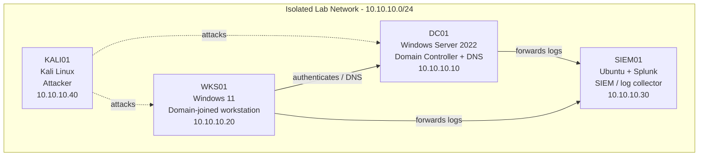

# Kali Capture Agent — Initial Setup

> Built and documented in an isolated home lab environment that I own.
> Documentation generated with LabScribe and reviewed by hand.

## 1. Overview

This session focused on configuring the LabScribe auto-capture agent on the Kali attacker box (KALI01). The goal was to have the shell automatically start a `script` session on login, writing terminal transcripts to a VirtualBox shared folder (`/media/sf_LabCapture/transcripts`) so that future attack sessions are captured for documentation without manual intervention. The session consisted of verifying the current user/shell, inspecting `~/.bashrc`, and confirming the LabScribe auto-record snippet was present and correctly configured.

| Host | OS | Role | IP |
|---|---|---|---|
| DC01 | Windows Server 2022 | Domain Controller + DNS | 10.10.10.10 |
| WKS01 | Windows 11 | Domain-joined workstation | 10.10.10.20 |
| SIEM01 | Ubuntu + Splunk | SIEM / log collector | 10.10.10.30 |
| KALI01 | Kali Linux | Attacker box | 10.10.10.40 |

## 2. Network Diagram

## 3. Build Steps

### KALI01 — Attacker box

- Confirmed current shell identity with `whoami` (returned `kali`), verifying the session was running as the standard non-root `kali` user before making changes to shell startup files. Command entry was visibly garbled by keyboard/terminal input issues during typing (see Troubleshooting Log), but the intended command and its output were still recoverable from the transcript.
- Attempted to view `~/.bashrc` directly via a shorthand path expression, which failed with a permission error; pivoted to opening the file in `nano` instead to inspect its contents safely.
- Opened `~/.bashrc` in `nano` and reviewed the full file. Confirmed the standard Kali default `.bashrc` content (history settings, prompt coloring, color aliases, bash completion) was intact and unmodified.
- Located and reviewed the LabScribe auto-capture snippet appended at the end of `.bashrc`. This snippet:
  - Defines `LABSCRIBE_DIR="/media/sf_LabCapture/transcripts"` as the target for transcript output, which corresponds to a VirtualBox shared folder mounted into the Kali VM.
  - Includes guard conditions checking that the target directory is reachable, the shell is interactive, and `LABSCRIBE_ACTIVE` is not already set — this prevents `script` from recursively re-spawning itself in an infinite loop.
  - Uses `exec script -q -a "$LABSCRIBE_DIR/$(date +%Y-%m-%d_%H%M)_$(hostname).txt"` to transparently begin logging every interactive shell session to a timestamped, hostname-tagged transcript file, which is the mechanism that produces the `.txt` transcripts fed into LabScribe.
  - Contains inline setup comments documenting the one-time manual steps required outside of `.bashrc`: adding the shared folder in VirtualBox settings, adding the user to the `vboxsf` group (`sudo usermod -aG vboxsf $USER`) so the shared folder is writable, and appending the snippet to `.bashrc` before opening a new terminal.
- No changes were made to the file during this session; the `nano` session appears to have been used for review/verification only, confirming the capture agent was already correctly installed and ready for use in future sessions.

No screenshots were captured during this session.

## 4. Troubleshooting Log

| Issue | Cause | Fix |
|---|---|---|
| `whoami` command appeared heavily duplicated/garbled in the transcript (`wwwhwhwhowhooawhoaammiwhoami`) | Likely dropped/repeated keystrokes from terminal input lag or a stuck key during typing, rather than an actual shell error | Command still executed correctly and returned expected output (`kali`); no fix needed beyond noting the input artifact |
| Attempt to read `~/.bashrc` via shorthand path (`~~~/~/..b~/.bbaasshhrrc`) failed with `zsh: permission denied: /home/kali/.bashrc` | The garbled/malformed path likely resolved to an unintended target, or the shell attempted to execute `.bashrc` directly rather than read it, which is not permitted since the file isn't executable | Switched to opening the file with `nano ~/.bashrc` instead, which succeeded and allowed safe inspection of the file contents |
| Command intended to open `nano passwords.txt` and/or `nano ~/.bashrc` was entered as a garbled compound string (`nnnano passwords.txtnanannonanoo o ~ ~~//..bbaasshhrrc`) | Same apparent keystroke duplication/input issue as above | Despite the garbled input, `nano` ultimately opened `/home/kali/.bashrc` successfully, confirming the intended target file was reached |

## 5. Attack & Detection Scenarios

*No activity captured for this section yet.*

## 6. Lessons Learned

- The LabScribe auto-capture snippet in `.bashrc` is functioning as designed: it auto-starts a logged `script` session per interactive shell without recursive loops, thanks to the `LABSCRIBE_ACTIVE` guard.
- Terminal input during this session was unreliable (repeated/garbled keystrokes across multiple commands), which suggests it may be worth checking VirtualBox terminal/input settings or keyboard passthrough before the next capture session to reduce transcript noise.
- Reviewing `.bashrc` via `nano` is a safer verification method than attempting to `cat`/source it with ad-hoc path expressions, especially under `zsh`.

## 7. Changelog

- **2026-08-06** — Initial setup/verification of the LabScribe auto-capture agent on KALI01; confirmed `.bashrc` snippet correctly configured to auto-log interactive shell sessions to the shared transcripts folder.