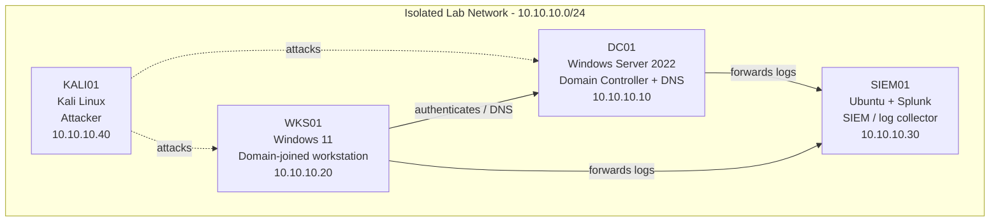

# SOC Home Lab — Active Directory + SIEM Detection Lab

> Built and documented in an isolated home lab environment that I own.
> Documentation generated with LabScribe and reviewed by hand.

## 1. Overview

This session (2026-08-02 06:05 → 2026-08-03 13:07) was focused entirely on the Ubuntu SIEM host (`soc-lab-ubuntu`, the machine tracked as SIEM01 in the lab inventory). Work started with basic shell familiarization, then a full `apt update` / `apt upgrade` (37 packages), then a first attempt at installing the Wazuh 4.12.0 all-in-one stack. That first install completed on paper but left `wazuh-indexer` and `wazuh-manager` in a failed state, with the dashboard up but unable to reach OpenSearch on `127.0.0.1:9200`. Root-causing that led to two real environment problems: the VM was under the Wazuh minimum hardware spec (RAM was doubled in VirtualBox per the 19:50 note), and the root logical volume was only 24 GB of a 48 GB partition and had filled to 100%. After extending the LV to the full ~48 GB and growing the filesystem, Wazuh was reinstalled cleanly with `-o` (overwrite) and all four components came up. Splunk Enterprise 10.4.2 was then downloaded and installed via `dpkg`, and `enable boot-start` was run. Per the session notes, both Wazuh and Splunk ended up reachable from the VM and from the host machine, and later in the day a ping test between two lab machines succeeded. One item is still open: reading Splunk logs from the Ubuntu terminal returned permission denied.

| Host | OS | Role | IP |
|---|---|---|---|
| DC01 | Windows Server 2022 | Domain Controller + DNS | 10.10.10.10 |
| WKS01 | Windows 11 | Domain-joined workstation | 10.10.10.20 |
| SIEM01 | Ubuntu + Splunk | SIEM / log collector | 10.10.10.30 |
| KALI01 | Kali Linux | Attacker box | 10.10.10.40 |

> Note: the only host with captured material this session is SIEM01, which reports its hostname as `soc-lab-ubuntu` (admin user `socadmin`). It now also runs the Wazuh 4.12.0 all-in-one stack (indexer + manager + Filebeat + dashboard) alongside Splunk. No IP addresses were shown in this session's transcripts, so the addresses above are carried over from the lab inventory and were not re-verified here.

## 2. Network Diagram

## 3. Build Steps

### SIEM01 — `soc-lab-ubuntu` (Ubuntu, Wazuh + Splunk)

1. **Shell familiarization (2026-08-02 10:58–11:05).** Confirmed the capture wrapper was live (`echo $LABSCRIBE_ACTIVE` → `1`), then poked at `ls`, `pwd`, `whoami`, and `help` to get oriented. Several inputs were Windows habits or typos (`LS`, `cmd`) and returned "command not found"; the script session ended with exit code 127 as a result. Nothing was configured here — this was orientation only, but it matters because everything later in the session was done from this same TTY console rather than over SSH.
2. **VM resource review and RAM increase (afternoon/evening of 2026-08-02).** The VirtualBox VM configuration was reviewed and, per the 19:50 note, RAM was doubled ("There's more then enough RAM space now as I've doubled it"). This was the first response to the Wazuh hardware-requirement error and matters because the Wazuh indexer is a JVM/OpenSearch process that will not stay up on an undersized guest (see `VirtualBoxVM_2DtOzJSqSe.png`, `VirtualBoxVM_NF0gdqKEyN.png`).
3. **Full system update (2026-08-02 22:40).** `sudo apt update` reported 39 upgradable packages; `sudo apt upgrade -y` then upgraded 37 (592 MB), including `base-files`, `iproute2`, `libgcrypt20`, `apport`, `fwupd`, `packagekit` and a large batch of `linux-firmware-*` packages, and regenerated `/boot/initrd.img-7.0.0-28-generic`. Patching before installing a SIEM matters so that later "why is this broken" debugging isn't confused by stale packages. `apt` also flagged old `linux-*-7.0.0-14` kernel packages plus `pollinate` as autoremovable — left in place for now (they are disk consumers, which becomes relevant in step 6).
4. **First Wazuh install attempt (2026-08-02 22:42–22:53).** Fetched the assistant with `curl -sO https://packages.wazuh.com/4.12/wazuh-install.sh` and ran `sudo bash wazuh-install.sh -a`. The assistant warned the running Ubuntu release is not on its recommended list, then hard-failed the hardware precheck (4 GB RAM / 2 CPU cores). Re-ran as `sudo bash wazuh-install.sh -a -i` to bypass the precheck; the run generated the root/admin/indexer/Filebeat/dashboard certificates and `wazuh-install-files.tar` (which holds the cluster key, certs and passwords — treat as `[REDACTED]`, do not commit), installed the indexer, manager, Filebeat and dashboard, and reported each service as started. The web interface port was set to 443.
5. **Post-install health check (2026-08-03 00:37–00:50).** `systemctl status` showed the real picture: `wazuh-indexer.service` **failed** (exit 1, 1.5 G memory peak), `wazuh-manager.service` **failed** (exit 1), and `wazuh-dashboard.service` active but logging `[ConnectionError]: connect ECONNREFUSED 127.0.0.1:9200` every ~2 s — i.e. the dashboard had no indexer to talk to. `free -h` showed only 3.3 GiB total RAM with 2.1 GiB free and 3.8 GiB swap unused, so memory pressure alone did not explain it. `sudo journalctl -u wazuh-indexer -n 50 --no-pager` showed a Lucene `IndexingChain.flush` / `PersistedClusterStateService$Writer.addMetadata` failure followed by `fatal error in thread [opensearch[node-1][scheduler][T#1]], exiting` and `java.lang.NoClassDefFoundError: Could not initialize class com.sun.jna.Native`, with a pointer to `/var/log/wazuh-indexer/wazuh-cluster.log`. Both symptoms are consistent with the indexer being unable to write to disk. Research and web-UI checks around this point were captured in the browser and VM windows (see `chrome_S8Xxs3lh73.png`, `VirtualBoxVM_YEVumwIsUS.png`, `chrome_RPsy7tVg48.png`).
6. **Disk / LVM expansion (2026-08-03 04:21–04:58).** A repeat `sudo bash wazuh-install.sh -a` refused to continue ("Wazuh manager already installed", same for indexer, dashboard and Filebeat) and suggested `-o/--overwrite`. Before doing that, `df -h` confirmed the actual fault: `/dev/mapper/ubuntu--vg-ubuntu--lv` was **24G, 24G used, 0 available, 100%**. `lsblk` showed `sda` is 50 G with `sda3` at 48 G but the logical volume only claiming 24 G — the Ubuntu installer default. After a couple of false starts (see Troubleshooting), `sudo modprobe dm-mod` then `sudo lvextend -l +100%FREE /dev/mapper/ubuntu--vg-ubuntu--lv` grew the LV from <24.00 GiB to <48.00 GiB, and `sudo resize2fs` grew the mounted root filesystem online to 12581888 4k blocks (~48 G). This is the fix that actually unblocked Wazuh — an OpenSearch node cannot flush cluster state onto a full root filesystem. `df -h` also showed the `LabCapture` shared folder at 96% used (23 G free), worth watching.
7. **Wazuh clean reinstall (2026-08-03 04:58–05:05).** `sudo bash wazuh-install.sh -a -o` removed the previous manager/indexer/Filebeat/dashboard, regenerated all certificates and the install-files tarball, and reinstalled the stack. This run passed the hardware check without `-i` (consistent with the RAM increase in step 2) and reported every service started: `wazuh-indexer` at 04:59:45, indexer cluster security initialized at 04:59:50, `wazuh-manager` at 05:01:52, `filebeat` at 05:02:01, `wazuh-dashboard` at 05:05:03, internal users updated (backup written to `/etc/wazuh-indexer/internalusers-backup`), `filebeat.yml` updated to use the Filebeat keystore credentials, and the dashboard web application initialized at 05:05:47. Generated credentials are deliberately not recorded here — `[REDACTED]`.
8. **Splunk Enterprise 10.4.2 install (2026-08-03 05:29–06:0x).** Downloaded `splunk-10.4.2-33c3bf42cd73-linux-amd64.deb` (1.24 GB) with `wget` at ~28 MB/s, then installed with `sudo dpkg -i splunk-10.4.2-33c3bf42cd73-linux-amd64.deb` (package `splunk (10.4.2)` unpacked and set up; one benign `find: '/opt/splunk/lib/python3.7/site-packages': No such file or directory` warning). Ran `sudo /opt/splunk/bin/splunk enable boot-start` and paged through the Splunk General Terms so Splunk starts automatically with the VM. Running Splunk alongside Wazuh is the point of this host — per the 12:28 note, this is "vital on my setup so that I'm able to analyze logs from future threats."
9. **Access + connectivity verification (2026-08-03, per notes).** The 01:30 note records that both Wazuh and Splunk were reachable from the host machine as well as from inside the VM, with one caveat carried forward: "Check for permissions again later for Splunk. Permissions were denied to check logs in Ubuntu terminal." The 12:34 note records that "Both machines successfully pinged one another" — the underlying transcript for that check was not captured, so the exact hosts and addresses are unconfirmed. Screenshots taken at that time appear to cover the connectivity/verification step (see `VirtualBoxVM_856aoJdkje.png`, `VirtualBoxVM_UFAuQvNU9K.png`).

### DC01 — Windows Server 2022 (Domain Controller + DNS)

*No activity captured for this section yet.*

### WKS01 — Windows 11 (domain-joined workstation)

*No activity captured for this section yet.*

### KALI01 — Kali Linux (attacker)

*No activity captured for this section yet.*

## 4. Troubleshooting Log

| Issue | Cause | Fix |
|---|---|---|
| `LS`, `cmd`, `hahaha` → "command not found"; `finally got it running :)` → `bash: syntax error near unexpected token ')'`; script session exited 127 | Windows/typo habits and free text typed at a bash prompt | Used the correct lowercase Linux commands (`ls`, `pwd`, `whoami`, `help`); no system impact |
| `wazuh-install.sh`: "The current system does not match with the list of recommended systems. The installation may not work properly." | Host is running a newer Ubuntu release than the assistant's supported list (16.04–22.04) | Accepted the risk and continued; noted as a possible contributor if the stack misbehaves later |
| `ERROR: Your system does not meet the recommended minimum hardware requirements of 4Gb of RAM and 2 CPU cores` | VM was provisioned under spec — `free -h` later confirmed only 3.3 GiB total RAM | Re-ran with `-i` to ignore the check for the first attempt, then doubled the VM's RAM in VirtualBox (19:50 note); the 04:58 reinstall passed the check without `-i` |
| `-i` and `i` entered as standalone commands → "command not found" | The installer flag was typed on its own line instead of appended to the command | Re-ran the full command as `sudo bash wazuh-install.sh -a -i` |
| `wazuh-indexer.service` failed (`code=exited, status=1/FAILURE`) and `wazuh-manager.service` failed after the first "successful" install | Indexer could not start, so the manager's dependency chain also failed; root cause traced to the full root filesystem | Fixed the disk (LVM extend + resize2fs) then reinstalled Wazuh with `-o`; all services reported started afterwards |
| `wazuh-dashboard` active but flooding `[ConnectionError]: connect ECONNREFUSED 127.0.0.1:9200` | Dashboard (OpenSearch Dashboards) was healthy but had no indexer listening on 9200 | Resolved as a side effect of getting `wazuh-indexer` running |
| `journalctl -u wazuh-indexer`: Lucene `IndexingChain.flush` / `PersistedClusterStateService.addMetadata` failure, then `fatal error in thread ... exiting` and `java.lang.NoClassDefFoundError: Could not initialize class com.sun.jna.Native` | Indexer could not write cluster state / initialize its native JNA library — both expected symptoms when there is zero free space on `/` | Freed space by extending the root LV from 24 G to ~48 G; full detail was also available in `/var/log/wazuh-indexer/wazuh-cluster.log` |
| `Notice: journal has been rotated since unit was started, output may be incomplete` | Journal rotated (likely pressured by the full disk) between service start and inspection | Used `journalctl -u <unit> -n 50 --no-pager` and the component's own log file under `/var/log/wazuh-indexer/` |
| Re-run of installer: `ERROR: Wazuh manager already installed` (and indexer / dashboard / Filebeat) | A partial-but-present install from the 22:48 run was already on disk | Followed the assistant's own advice and used `sudo bash wazuh-install.sh -a -o` to wipe and reinstall once the disk was fixed |
| `df -h`: `/dev/mapper/ubuntu--vg-ubuntu--lv` 24G, 0 available, **100% used** on `/` | Ubuntu's guided-LVM installer only allocated ~24 G of the 48 G `sda3` partition to the root LV; the apt upgrade plus the Wazuh stack filled it | `sudo lvextend -l +100%FREE /dev/mapper/ubuntu--vg-ubuntu--lv` (24 GiB → 48 GiB) then `sudo resize2fs` for an online grow to 12581888 blocks |
| `sudo lvextend -1 ... +100%FREE` → `lvextend: invalid option -- '1'` | Digit `1` typed instead of lowercase `-l` | Retyped with `-l` |
| `lvextend -l +100%FREE ...` (no sudo) → `WARNING: Running as a non-root user`, `/dev/mapper/control: open failed: Permission denied`, `Incompatible libdevmapper 1.02.205 and kernel driver (unknown version)`, `Can't get lock for ubuntu-vg` | Command run unprivileged, and the `dm-mod` kernel module was not loaded (`lsmod \| grep dm_mod` returned nothing) so libdevmapper could not talk to the kernel | `sudo modprobe dm-mod`, then re-ran the extend with `sudo` — succeeded |
| `resize2fs` → `The filesystem is already 6290432 (4k) blocks long. Nothing to do!` | Run before the logical volume had actually been extended | Re-ran `resize2fs` after the successful `lvextend`; filesystem grew online to 12581888 blocks |
| `dpkg -i /media/sf_LabCapture/splunk-*.deb` → `cannot access archive: No such file or directory`, then `dpkg -i splunk.deb` → same | The `.deb` was saved to the home directory under its full versioned filename, not to the shared folder and not as `splunk.deb` (the `-O splunk.deb` in the `wget` line was edited out before execution) | Installed using the actual filename: `sudo dpkg -i splunk-10.4.2-33c3bf42cd73-linux-amd64.deb` |
| Splunk postinstall warning: `find: '/opt/splunk/lib/python3.7/site-packages': No such file or directory` | Legacy path referenced by the package's setup script; this Splunk build ships a different Python version | No action needed — `Setting up splunk (10.4.2)…` finished with `complete` and the install was usable |
| "Permissions were denied to check logs in Ubuntu terminal" for Splunk (01:30 note) | Splunk log files under `/opt/splunk/var/log/splunk/` are owned by root/the Splunk service account, and `socadmin` is not in that group | **Open** — plan is to read them with `sudo` and/or fix group membership/ownership; flagged in the note for follow-up |
| `LabCapture` shared folder at 96% (443 G used, 23 G free) | Session captures and installers accumulating on the host-shared volume | Not addressed this session; monitor before the next long capture run |

## 5. Attack & Detection Scenarios

| Scenario | Attack (KALI01) | Detection (SIEM01) | Status |
|---|---|---|---|
| *No attack or detection activity captured for this session yet — work was limited to standing up the SIEM host.* | — | — | Not started |

## 6. Lessons Learned

- "Installer reported success" is not the same as "service is running." The first Wazuh run printed `INFO: wazuh-indexer service started`, but `systemctl status` showed both the indexer and manager had already failed. Always verify with `systemctl status` / `journalctl` after an all-in-one installer.
- A repeating `ECONNREFUSED 127.0.0.1:9200` in the Wazuh dashboard is almost never a dashboard problem — it means the indexer is down. Chase the dependency, not the loudest log.
- Ubuntu's guided LVM install leaves roughly half the disk unallocated. `lsblk` + `df -h` together (partition size vs. LV size vs. free space) is the fastest way to spot it. Doing `lvextend -l +100%FREE` + `resize2fs` right after OS install would have avoided most of this session's pain.
- `lvextend` failures that mention `/dev/mapper/control: open failed` are a two-part problem: run it with `sudo`, and make sure `dm-mod` is loaded (`lsmod | grep dm_mod`, then `modprobe dm-mod`).
- Disk exhaustion shows up as weird, unrelated-looking Java errors (Lucene flush failures, `NoClassDefFoundError` on `com.sun.jna.Native`). Check `df -h` early when a JVM service dies in a way that makes no sense.
- Bypassing a hardware precheck with `-i` gets the installer to run but doesn't make the box adequate — the real fix was giving the VM more RAM.
- Note the exact downloaded filename before running `dpkg -i`; guessing at `splunk.deb` or a shared-folder path cost two failed commands.
- `wazuh-install-files.tar` and the generated internal-user passwords are secrets. Keep them off the repo; the internal-users backup lives at `/etc/wazuh-indexer/internalusers-backup`.

## 7. Changelog

- **2026-08-02 → 2026-08-03 — Ubuntu SIEM host: disk, LVM & Wazuh/Splunk install.** Patched the OS (37 packages). Increased VM RAM after the Wazuh hardware precheck failed. First Wazuh 4.12.0 all-in-one install left the indexer and manager failed with the dashboard stuck on `ECONNREFUSED 127.0.0.1:9200`; traced to `/` being 100% full at 24 G. Loaded `dm-mod`, extended the root LV to the full ~48 G and grew the ext4 filesystem online, then reinstalled Wazuh with `-o` — indexer, manager, Filebeat and dashboard all came up and the dashboard web app initialized. Installed Splunk Enterprise 10.4.2 from `.deb` and enabled boot-start. Both UIs confirmed reachable from the VM and the host per session notes; a later ping test between two lab machines succeeded. Open item: permission denied when reading Splunk logs as `socadmin`.