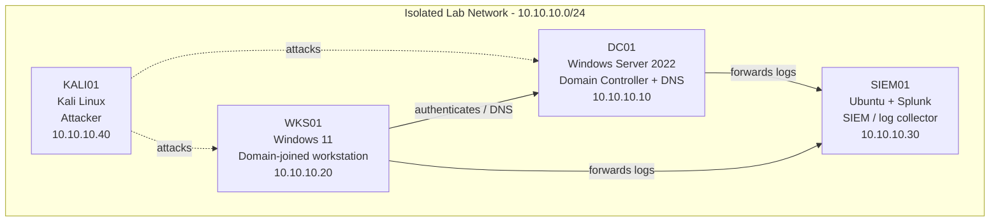

# SOC Lab — Rule Adding and Conditions Session

> Built and documented in an isolated home lab environment that I own.
> Documentation generated with LabScribe and reviewed by hand.

## 1. Overview

This session focused on SIEM01 (`soc-lab-ubuntu`), the Ubuntu/Splunk/Wazuh log collection host. Work centered on routine system maintenance — refreshing package lists and installing build tooling (`build-essential`, `dkms`, matching kernel headers) likely in preparation for building VirtualBox Guest Additions kernel modules — followed by mounting and browsing the VirtualBox Guest Additions CD image. The shell history also contains fragments referencing earlier or planned work on Wazuh custom detection rules (`local_rules.xml`) and a Splunk forwarder listener on port 9997, though these were not confirmed as executed within this session's captured output.

| Host | OS | Role | IP |
|---|---|---|---|
| DC01 | Windows Server 2022 | Domain Controller + DNS | 10.10.10.10 |
| WKS01 | Windows 11 | Domain-joined workstation | 10.10.10.20 |
| SIEM01 | Ubuntu + Splunk | SIEM / log collector | 10.10.10.30 |
| KALI01 | Kali Linux | Attacker box | 10.10.10.40 |

## 2. Network Diagram

## 3. Build Steps

### SIEM01 (soc-lab-ubuntu)

- Ran `sudo apt update` to refresh the package index ahead of installing new tooling. The command as typed in the transcript appears garbled (`sudo nanoapt update`), but the subsequent output matches a normal `apt update` run against the Wazuh, Ubuntu archive, and security repos, indicating the update proceeded correctly. Result: 35 packages flagged as upgradable.
- Attempted to install `build-essential`, `dkms`, and the running kernel's `linux-headers` package — this toolchain is typically needed to compile kernel modules, most likely for installing VirtualBox Guest Additions on the SIEM VM. This matters because Guest Additions improve clipboard/shared-folder/display integration for a VM used heavily for day-to-day SIEM administration.
- First install attempt failed due to a missing hyphen in the package name (`build essential` instead of `build-essential`); corrected and re-run successfully. `build-essential` and the matching `linux-headers` package were already present and were marked manually installed; `dkms` was newly installed.
- Post-install trigger processing automatically restarted `wazuh-indexer.service` as part of the system's outdated-service scan (via `needrestart`), confirming a wazuh-indexer component is running on this host.
- Located and mounted the VirtualBox Guest Additions CD image: an initial `cd /media/cdrom` failed because the mount point didn't exist yet; the disk was identified via `lsblk` as `sr0` (51M ROM device), then mounted with `sudo mount /dev/cdrom /media/cdrom` (read-only, as expected for optical media).
- Browsed the mounted ISO contents, confirming it is the standard VirtualBox Guest Additions distribution (`VBoxLinuxAdditions.run`, `VBoxWindowsAdditions*.exe`, `windows11-bypass.reg`, `autorun.sh`, etc.). No install script was executed within this session's captured transcript.
- The shell history buffer also shows fragments referencing `/var/ossec/etc/rules/local_rules.xml` (Wazuh custom rules file), `wazuh-manager`/`wazuh-dashboard` service status/restarts, and Splunk listener setup (`/opt/splunk/bin/splunk enable listen 9997`) — these appear to be from earlier sessions bleeding into the recorded history and are not confirmed as run during this capture.
- No screenshots were provided for this session.

### DC01 / WKS01 / KALI01

*No activity captured for this section yet.*

## 4. Troubleshooting Log

| Issue | Cause | Fix |
|---|---|---|
| `sudo apt install -y build essential dkms linux-headers-$(uname -r)` failed with `Error: Unable to locate package build` / `Error: Unable to locate package essential` | Package name typo — missing hyphen split `build-essential` into two invalid package names | Re-ran the command with the correct hyphenated name `build-essential`; install succeeded |
| `cd /media/cdrom` failed with `No such file or directory` | The CD-ROM device (`sr0`) had not yet been mounted, so the mount point path had nothing to change into | Verified the optical device with `lsblk`, then ran `sudo mount /dev/cdrom /media/cdrom` to mount it |
| `ls /media/$USER/` returned `cannot access '/media/socadmin/': No such file or directory` | No removable media was auto-mounted under the per-user media directory | Fell back to manually mounting `/dev/cdrom` to `/media/cdrom` instead of relying on auto-mount |
| `mount` reported `WARNING: source write-protected, mounted read-only` | Expected behavior — the source is a read-only ISO (VirtualBox Guest Additions CD) | No fix needed; informational only, browsing proceeded normally |
| Shell history shows a garbled, concatenated block of unrelated commands (Wazuh rule edits, Splunk listener setup, service restarts all run together on one line) | Likely a terminal/tty rendering or history-scrollback artifact rather than commands actually executed in sequence during this session | No fix applied; flagged here so it isn't mistaken for verified session activity |

## 5. Attack & Detection Scenarios

*No activity captured for this section yet.*

## 6. Lessons Learned

- Double-check hyphenation on multi-word package names (`build-essential`) before running `apt install` — a missing hyphen splits it into two nonexistent packages.
- Confirm a mount point/device is actually mounted (`lsblk`) before `cd`-ing into it; optical media on this VM doesn't appear to auto-mount under `/media/$USER/`.
- Terminal capture can occasionally merge unrelated history lines into a single garbled block — treat these as recording artifacts, not verified command execution, when writing up session notes.

## 7. Changelog

- **2026-08-07** — SIEM01 maintenance session: ran `apt update`, installed `build-essential`/`dkms`/kernel headers (likely for VirtualBox Guest Additions), mounted and inspected the Guest Additions ISO. Wazuh-indexer service auto-restarted post-install. No Wazuh rule changes or Splunk listener changes confirmed as executed in this session's captured output.